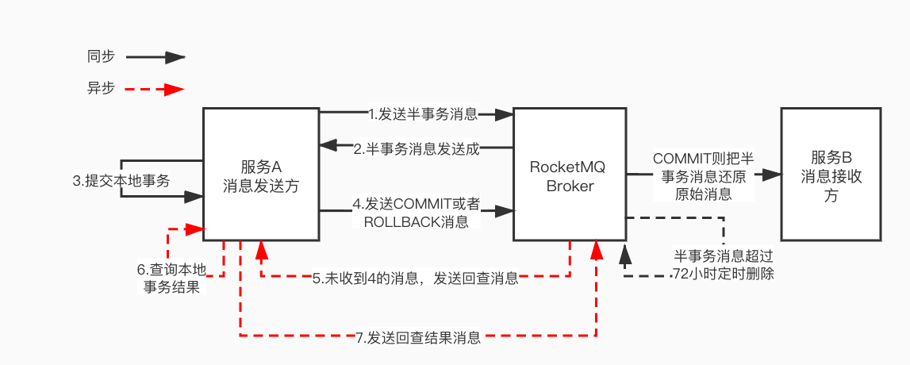

RocketMQ的事务消息通过**两阶段提交（2PC）** 实现的，核心是 Half 消息。下面我们来具体聊聊。

## 一、**核心流程**

先来看看官网上的一张图：


再来张中文版的：



1. **发送半消息（Half Message）**
   - 生产者发送一条**对消费者不可见**的消息到Broker（状态为`PREPARED`）。
   - Broker存储消息（但不会投递给消费者），并响应生产者。
2. **执行本地事务**
   - 生产者收到半消息确认后，**执行本地事务**（如数据库操作）。
3. **提交或回滚事务**
   - **成功提交**：生产者发送`commit`指令，Broker将消息标记为`COMMITTED`（对消费者可见）。
   - **失败回滚**：生产者发送`rollback`指令，Broker删除半消息。
   - **未响应**：若生产者宕机/超时未响应，进入**事务回查机制**。
4. **事务状态回查**
   - Broker定时扫描未处理的半消息（`PREPARED`状态），向生产者发起回查请求。
   - 生产者检查本地事务状态，返回`commit`/`rollback`结果。
   - Broker根据回查结果提交或删除消息。


## 二、**生产者端实现**

```java
// 1. 创建事务生产者
TransactionMQProducer producer = new TransactionMQProducer("group");
producer.setNamesrvAddr("localhost:9876");

// 2. 设置事务监听器（核心）
producer.setTransactionListener(new TransactionListener() {
    // 执行本地事务
    @Override
    public LocalTransactionState executeLocalTransaction(Message msg, Object arg) {
        try {
            // 业务操作（如更新数据库）
            boolean success = doBusinessLogic();
            return success ? 
                LocalTransactionState.COMMIT_MESSAGE : LocalTransactionState.ROLLBACK_MESSAGE;
        } catch (Exception e) {
            return LocalTransactionState.UNKNOW; // 触发回查
        }
    }

    // Broker回查时调用
    @Override
    public LocalTransactionState checkLocalTransaction(MessageExt msg) {
        // 根据消息内容检查本地事务状态
        return checkBusinessStatus(msg) ? 
            LocalTransactionState.COMMIT_MESSAGE : LocalTransactionState.ROLLBACK_MESSAGE;
    }
});

// 3. 发送半消息
Message msg = new Message("Topic", "Tag", "Hello TX".getBytes());
SendResult result = producer.sendMessageInTransaction(msg, null);
```


`RocketMQLocalTransactionListener` 接口规范了事务监听类必须实现的两个接口：`executeLocalTransaction`用于执行本地事务，`checkLocalTransaction` 用于 broker 回调，检查本地事务执行。

```java
package org.apache.rocketmq.spring.core;

import org.springframework.messaging.Message;

public interface RocketMQLocalTransactionListener {
    RocketMQLocalTransactionState executeLocalTransaction(final Message msg, final Object arg);

    RocketMQLocalTransactionState checkLocalTransaction(final Message msg);
}
```


## 三、**Broker端处理**

- **半消息存储**：半消息存入单独的Topic（`RMQ_SYS_TRANS_HALF_TOPIC`），避免被消费。
- **定时任务扫描**：
  - Broker启动定时任务（默认60秒），扫描超过阈值的半消息。
  - 向生产者发起回查（最多15次，超过则视为失败）。
- **状态转换**：
  - `COMMIT` → 将消息恢复到原Topic，供消费者消费。
  - `ROLLBACK`/超时 → 删除半消息。

## 四、异常情况

### 异常1：如果步骤 4 发生异常（`COMMIT`或`ROLLBACK`发送失败）怎么办？

在RocketMQ的事务消息机制中，若Broker长时间未收到生产者发送的`COMMIT`或`ROLLBACK`指令（例如因生产者宕机、网络故障或本地事务执行超时），系统会通过**事务状态回查机制**确保消息的最终一致性。

------

#### 1. 事务状态回查机制

- **触发条件**：
  Broker在固定周期（默认60秒）内扫描未确认状态（`PREPARED`）的半消息（half消息）。若消息超过指定等待时间仍未收到确认指令，则触发回查。
- **回查流程**：
  - Broker向生产者发起回调请求，调用生产者实现的`TransactionListener.checkLocalTransaction()`方法；
  - 生产者需在该方法中查询本地事务状态（如检查数据库操作结果）；
  - 根据业务状态返回以下结果之一：
    - `COMMIT_MESSAGE`：提交消息（消息对消费者可见）；
    - `ROLLBACK_MESSAGE`：回滚消息（删除半消息）；
    - `UNKNOW`：状态未明，等待下次回查。

------

####  2. **Broker端的处理逻辑**

- **消息存储隔离**：
  半消息存储在特殊Topic（`RMQ_SYS_TRANS_HALF_TOPIC`）中，消费者无法直接消费，确保未提交消息不会泄露。
- **回查策略**：
  - 回查次数限制：默认最多15次（可配置），超过后自动视为失败并回滚消息；
  - 回查间隔：首次回查后若仍返回`UNKNOW`，后续回查间隔逐步增加（如60秒→2分钟→10分钟）。
- **结果处理**：
  - 收到`COMMIT`：将消息从`RMQ_SYS_TRANS_HALF_TOPIC`转移到原始Topic，写入磁盘（CommitLog）并投递给消费者；
  - 收到`ROLLBACK`：删除半消息；
  - 持续`UNKNOW`：达到最大回查次数后强制回滚。

------

#### 3. **生产者端的实现要求**

生产者需在`checkLocalTransaction()`方法中实现**幂等且可靠的状态查询逻辑**，例如：

```
@Override
public LocalTransactionState checkLocalTransaction(MessageExt msg) {
    // 根据消息唯一ID查询数据库事务状态
    String orderId = msg.getProperty("ORDER_ID");
    boolean isSuccess = orderService.isTransactionCompleted(orderId);
    return isSuccess ? 
        LocalTransactionState.COMMIT_MESSAGE : LocalTransactionState.ROLLBACK_MESSAGE;
}
```

**注意事项**：

- **幂等性**：多次回查可能针对同一消息，需避免重复提交或回滚；
- **状态判断**：若事务结果依赖外部调用（如RPC），需设计降级策略（如超时后视为失败）。

------

####  4. **极端场景的应对**

- **生产者永久宕机**：
  Broker在多次回查失败后自动回滚消息，避免消息积压。
- **回查期间业务状态变更**：
  生产者需记录事务日志（如数据库事务表），确保回查时能获取准确状态。

------

#### **总结**

| 环节         | 动作                                                         |
| ------------ | ------------------------------------------------------------ |
| **Broker**   | 定时扫描未确认消息 → 触发回查 → 根据结果提交/回滚/重试       |
| **生产者**   | 实现状态检查接口 → 查询本地事务日志 → 返回明确状态           |
| **消息存储** | 半消息隔离存储（`RMQ_SYS_TRANS_HALF_TOPIC`） → 提交后转至目标Topic |


------

