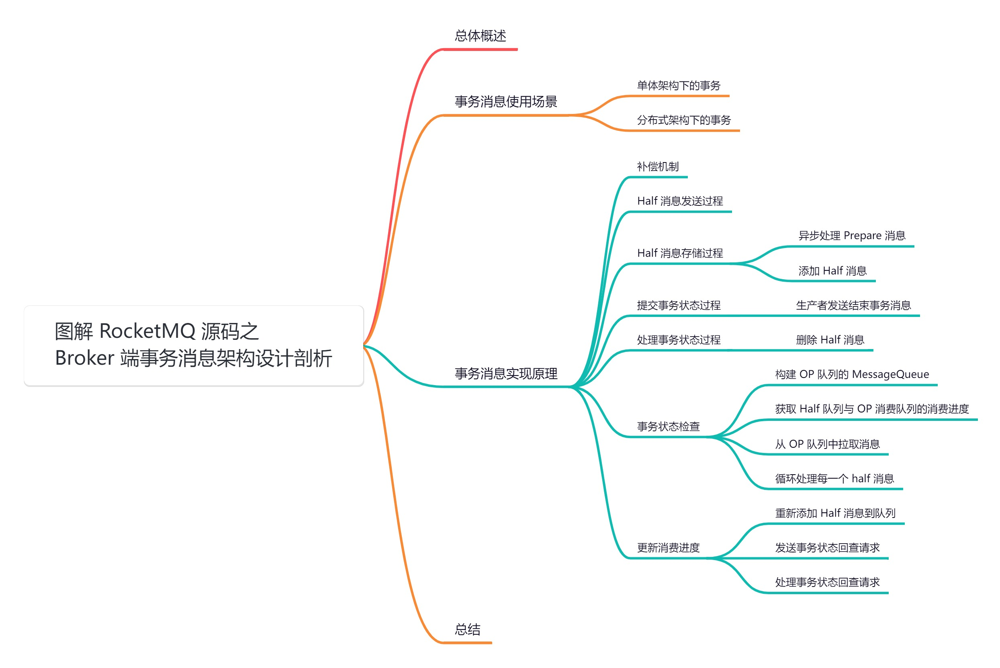

#  **01 总体概述**

这里我将以「**RocketMQ 5.1.2**」版本为主，通过「**场景驱动**」的方式带大家一点点的对 RocketMQ 源码进行深度剖析

# **02 事务消息使用场景**

##  **2.1 单体架构下的事务**


在单体系统的开发过程中，假如某个场景下需要对数据库的多张表进行操作，为了保证数据的一致性，一般会使用事务，将所有的操作全部提交或者在出错的时候全部回滚。

这里以创建订单为例，假设下单后需要做两个操作：

1. 在订单表生成订单。
2. 在积分表增加本次订单增加的积分记录。


在单体架构下只需使用 [@Transactional](http://transactional/) 开启事务，就可以保证数据的一致性：

```java
@Transactional
public void order() {

    String orderId = UUID.randomUUID().toString();

    // 生成订单
    orderService.createOrder(orderId);

    // 增加积分
    creditService.addCredits(orderId);
}
```


然而现在越来越多系统开始使用分布式架构，在分布式架构下，「**订单系统**」和「**积分系统**」可能是两个独立的服务，此时就不能使用上述的方法开启事务了，因为它们不处于同一个事务中，在出错的情况下无法进行全部回滚，只能对当前服务的事务进行回滚，所以就有可能出现「**订单生成成功**」但是「**积分服务增加积分失败**」的情况，此时数据处于不一致的状态。


## **2.2 分布式架构下的事务**


分布式架构下如果需要「**保证事务一致性**」，需要使用分布式事务，分布式事务的实现方式有多种，这里我们先看通过 RocketMQ 事务的实现方式。

同样以下单流程为例，在分布式架构下的处理流程如下：

1. 订单服务生成订单。

2. 发送订单生成的 MQ 消息，积分服务订阅消息，有新的订单生成之后消费消息，增加对应的积分记录。

   

### **2.2.1 普通MQ事务消息存在的问题**

如果使用 [@Transactional + 发送普通MQ](http://xn--transactional + mq-1q41bp14yehrkvsa/) 的方式，看下存在的问题：

1. 假如订单创建成功，MQ 消息发送成功，但是 order 方法在返回的前一刻服务突然宕机，由于开启了事务，事务还未提交（方法结束后才会正常提交），所以订单表并未生成记录，但是 MQ 却已经发送成功并且被积分服务消费，此时就会存在订单未创建但是积分记录增加的情况。
2. 假如先发送 MQ 消息再创建订单呢，此时问题就更明显了，如果 MQ 消息发送成功，创建订单失败，那么同样处于不一致的状态。

```java
@Transactional
public void order() {

    String orderId = UUID.randomUUID().toString();

    // 创建订单
    Order order = orderService.createOrder(orderDTO.getOrderId());

    // 发送订单创建的MQ消息
    sendOrderMessge(order);
    
    return;
}
```


要彻底解决上述问题的方式就是使用 RocketMQ 事务消息。


### **2.2.2 RocketMQ 事务消息**


使用「**事务消息**」需要实现「**自定义的事务监听器**」：


1. [TransactionListener](http://transactionlistener/) 提供了「**本地事务执行**」和「**状态回查**」的接口。
2. [executeLocalTransaction](http://executelocaltransaction/) 方法用于执行「**本地事务**」。
3. [checkLocalTransaction](http://checklocaltransaction/) 是一种补偿机制，在异常情况下如果未收到事务的提交请求，会调用此方法进行事务状态查询，以此决定是否将事务进行提交/回滚。

```java
public interface TransactionListener {
    /**
     * 执行本地事务
          *
          * @param msg Half(prepare) message half消息
               * @param arg Custom business parameter
               * @return Transaction state
                    */
                LocalTransactionState executeLocalTransaction(final Message msg, final Object arg);

    /**
     * 本地事务状态回查
          *
         * @param msg Check message
               * @return Transaction state
               */
            LocalTransactionState checkLocalTransaction(final MessageExt msg);
}
```


这里我们实现自定义的事务监听器 [OrderTransactionListenerImpl](http://ordertransactionlistenerimpl/):

1. [executeLocalTransaction](http://executelocaltransaction /) 方法中创建订单，如果创建成功返回 [COMMIT_MESSAGE](http://commit_message/)，如果出现异常返回[ROLLBACK_MESSAGE](http://rollback_message/)。
2. [checkLocalTransaction](http://checklocaltransaction/) 方法中回查事务状态，根据消息体中的订单 ID 查询订单是否已经创建。
3. 如果创建成功提交事务。
4. 如果未获取到认为失败，此时回滚事务。


```java
public class OrderTransactionListenerImpl implements TransactionListener {

    @Autowired
    private OrderService orderService;

    // 执行本地事务
    @Override
   public LocalTransactionState executeLocalTransaction(Message msg, Object arg) {

        try {

            // 生成消息体
            String body = new String(msg.getBody(), Charset.forName("UTF-8"));

           OrderDTO orderDTO = JSON.parseObject(body, OrderDTO.class);

            // 模拟生成订单
            orderService.createOrder(orderDTO.getOrderId());

       } catch (Exception e) {

           // 出现异常，返回回滚状态
           return LocalTransactionState.ROLLBACK_MESSAGE;
       }

       // 创建成功，返回提交状态
        return LocalTransactionState.COMMIT_MESSAGE;

    }


   // 检查本地事务
   @Override
    public LocalTransactionState checkLocalTransaction(MessageExt msg) {

        String body = new String(msg.getBody(), Charset.forName("UTF-8"));
       OrderDTO orderDTO = JSON.parseObject(body, OrderDTO.class);

       try {
            // 根据订单ID查询订单是否存在
           Order order = orderService.getOrderByOrderId(orderDTO.getOrderId());

           if (null != order) {
                // 提交事务
               return LocalTransactionState.COMMIT_MESSAGE;
            }
        } catch (Exception e) {
            // 回滚事务
           return LocalTransactionState.ROLLBACK_MESSAGE;
        }
        // 回滚事务
       return LocalTransactionState.ROLLBACK_MESSAGE;

    }
}
```


接下来我们来看下「**如何发送事务消息**」的，事务消息对应的生产者为 [TransactionMQProducer](http://transactionmqproducer/)，创建[TransactionMQProducer](http://transactionmqproducer/) 之后，设置上一步自定义的事务监听器 [OrderTransactionListenerImpl](http://ordertransactionlistenerimpl/)，然后将订单 ID放入消息体中， 调用 [sendMessageInTransaction](http://sendmessageintransaction/) 发送事务消息：


```java

public class TransactionProducer {

    public static void main(String[] args) throws MQClientException, InterruptedException {

       // 创建下单事务监听器
       TransactionListener transactionListener = new OrderTransactionListenerImpl();

        // 创建生产者
       TransactionMQProducer producer = new TransactionMQProducer("order_group");

       // 事务状态回查线程池
       ExecutorService executorService = new ThreadPoolExecutor(2, 5, 100, TimeUnit.SECONDS, new ArrayBlockingQueue<Runnable>(2000), new ThreadFactory() {

           @Override
           public Thread newThread(Runnable r) {
               Thread thread = new Thread(r);
               thread.setName("client-transaction-msg-check-thread");
               return thread;
           }

        });

       // 设置线程池
        producer.setExecutorService(executorService);

        // 设置事务监听器
        producer.setTransactionListener(transactionListener);

        // 启动生产者
       producer.start();

       try {

           // 创建订单消息
           OrderDTO orderDTO = new OrderDTO();

           // 模拟生成订单唯一标识
           orderDTO.setOrderId(UUID.randomUUID().toString());

          // 转为字节数组
           byte[] msgBody = JSON.toJSONString(orderDTO).getBytes(RemotingHelper.DEFAULT_CHARSET);

            // 构建消息
            Message msg = new Message("ORDER_TOPIC", msgBody);

            // 调用 sendMessageInTransaction 发送事务消息
           SendResult sendResult = producer.sendMessageInTransaction(msg, null);
           System.out.printf(sendResult.toString());
            // 休息10s
           Thread.sleep(10);
        } catch (MQClientException | UnsupportedEncodingException e) {
            e.printStackTrace();
        }

        for (int i = 0; i < 100000; i++) {
           Thread.sleep(1000);
        }
        producer.shutdown();
    }
}
```


整个的执行流程：


1. 在订单服务下单后，向 Borker 发送生成订单的事务消息，投递到 [ORDER_TOPIC](http://order_topic/) 主题中。
2. Broker 收到事务消息之后，不会直接投递到 [ORDER_TOPIC](http://order_topic/) 主题中，而是先放在另外一个主题中，也叫 [half 主题](http://xn--half -t73k1046c/)，half 主题对消费者不可见。
3. half 主题加入消息成功之后，会回调事务监听器的的 [executeLocalTransaction](http://executelocaltransaction/) 方法，执行本地事务也就是订单创建，如果创建成功返回 [COMMIT](http://commit/) 状态，如果出现异常返回 [ROLLBACK](http://rollback/) 状态。
4. 根据上一步的返回状态进行结束事务的处理。
5. 提交：从 [half 主题](http://xn-- half -jy2p2252e/) 中删除消息，然后将消息投送到 [ORDER_TOPIC](http://order_topic/) 主题中，积分服务订阅 [ORDER_TOPIC](http://order_topic/) 主题进行消费，生成积分记录。
6. 回滚：从 [half主题](http://xn--half-3h5fu250b/) 中删除消息即可。
7. 如果本地事务返回的执行结果状态由于网络原因或者其他原因未能成功的发送给 Broker，Broker 未收到事务的执行结果，在补偿机制定时检查 [half主题](http://xn--half-3h5fu250b/) 中消息的事务执行状态时，会回调事务监听器 [checkLocalTransaction](http://checklocaltransaction/) 的接口，进行状态回查，判断订单是否创建成功，然后进行结束事务的处理。


# **03 事务消息实现原理**


在 RocketMQ 4.3.0 版中开始支持事务消息，它通过使用「**两阶段 2PC 提交协议**」来实现事务消息，同时增加「**补偿机制**」定时对事务的状态进行回查，来处理「**未提交/回滚**」的事务。


发送事务消息分为两个阶段：


1. 第一阶段：生产者向 Broker 发送 [half（prepare）](http://half(prepare)/) 消息，生产者发送事务消息的时候，消息不会直接存入对应的主题中，而是先将消息存入 [RMQ_SYS_TRANS_HALF_TOPIC](http://rmq_sys_trans_half_topic/) 主题中，此时消息对「**消费者不可见**」不能被消费者消费，称为 [half 消息](http://xn--half -yn4n665g/)，half 消息发送成功之后，开始执行本地事务。
2. 第二阶段：提交阶段，根据第一阶段的本地事务执行结果来决定是提交事务还是回滚事务，提交或者回滚的事务会从[RMQ_SYS_TRANS_HALF_TOPIC](http://rmq_sys_trans_half_topic/) 中删除，对于提交的事务消息，会将消息投送到实际的主题队列中，之后消费者可以从队列中拉取到消息进行消费，对于回滚的事务消息，直接从 [RMQ_SYS_TRANS_HALF_TOPIC](http://rmq_sys_trans_half_topic/) 主题中删除即可。


注意：由于 RocketMQ 追加写的性能并不会直接从 [RMQ_SYS_TRANS_HALF_TOPIC](http://rmq_sys_trans_half_topic/) 队列中删除消息，而是使用了另外一个队列，将已提交或者回滚的事务放入到 OP 队列中，在补偿机制对 [half 消息](http://xn--half -yn4n665g/)进行检查的时候会从 OP 中判断是消息是否「**已提交**」或者「**回滚**」。


## **3.1 补偿机制** 


两阶段提交事务的过程中，任一阶段出现异常都有可能导致事务未能成功的进行「**提交**」或者「**回滚**」，所以需要增加「**补偿机制**」来定时对 [RMQ_SYS_TRANS_HALF_TOPIC](http://rmq_sys_trans_half_topic/) 主题中的 [half 消息](http://xn--half-ti4hr48d/) 进行处理。


RocketMQ 使用了一种「**回查机制**」，在处理 [half 消息](http://xn--half -yn4n665g/)时，对该消息的「**本地事务**」执行状态进行回查，根据回查结果决定是否需要「**提交**」或者「**回滚**」，或者是等待下一次回查。


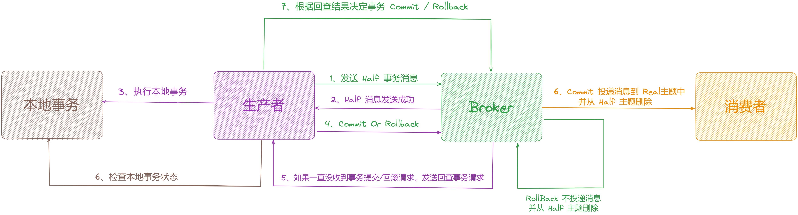


接下来我们就从源码的角度研究一下事务的实现原理。


整个事务消息的处理流程，可以分为以下五大步骤：


1. Half 消息发送过程
2. Half 消息存储过程
3. 提交事务状态过程
4. 处理事务状态过程
5. 事务回查过程
6. 更新消费进度


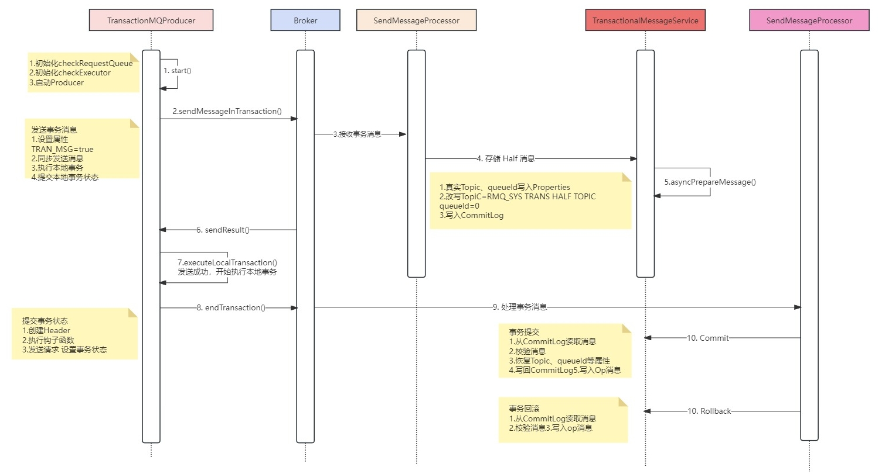

**
**

## **3.2 Half 消息发送过程**


[TransactionMQProducer](http://transactionmqproducer /) 是 RocketMQ 提供的支持发送事务消息的生产者，它继承自 [DefaultMQProducer](http://defaultmqproducer/)，也是一个外观类，非常的简单，核心逻辑依然在 [DefaultMQProducerImpl](http://defaultmqproducerimpl/)，属性如下：


```java

public class TransactionMQProducer extends DefaultMQProducer {

    // 事务回查监听

    private TransactionCheckListener transactionCheckListener;

    // 回查线程池最小线程数

    private int checkThreadPoolMinSize = 1;

    // 回查线程池最大线程数

    private int checkThreadPoolMaxSize = 1;

    // 最大回查请求数，阻塞队列容量

   private int checkRequestHoldMax = 2000;

    // 执行本地事务/事务回查的线程池

    private ExecutorService executorService;

    // 事务监听器:本地事务、事务回查逻辑

    private TransactionListener transactionListener;

    ....

}
```


启动 [TransactionMQProducer](http://transactionmqproducer/) 必须先注册 [TransactionListener](http://transactionlistener/)，实现「**本地事务的执行逻辑**」和「**事务回查逻辑**」，Producer 在发送 [half 消息](http://xn--half -yn4n665g/) 成功后会自动执行 [executeLocalTransaction](http://executelocaltransaction/)，在 Broker 请求事务回查时自动执行 [checkLocalTransaction](http://checklocaltransaction/)。


然后，[Producer](http://producer/) 就可以启动了，在启动默认 [Producer](http://producer/) 之前，会对 [checkExecutor](http://checkexecutor/) 和 [checkRequestQueue](http://checkrequestqueue/) 进行初始化，如果没有设置线程池会自动创建。


```java

public class DefaultMQProducerImpl implements MQProducerInner {

    /**
     * 初始化事务 env
     */
    public void initTransactionEnv() {

        // 强制转换成事务生产者
        TransactionMQProducer producer = (TransactionMQProducer) this.defaultMQProducer;

        if (producer.getExecutorService() != null) {
            this.checkExecutor = producer.getExecutorService();
        } else {

            // 事务回查请求队列
            this.checkRequestQueue = new LinkedBlockingQueue<>(producer.getCheckRequestHoldMax());

            // 事务回查线程池
            this.checkExecutor = new ThreadPoolExecutor(
                producer.getCheckThreadPoolMinSize(),
                producer.getCheckThreadPoolMaxSize(),
                1000 * 60,
                TimeUnit.MILLISECONDS,
                this.checkRequestQueue);
        }
    }
}

```


初始化完成以后，就是 [Producer](http://producer/) 的正常启动逻辑，这里不再赘述。通过上面得出，发送事务消息调用的是 [TransactionMQProducer#sendMessageInTransaction](http://transactionmqproducer/#sendMessageInTransaction) 方法：


```java

public class TransactionMQProducer extends DefaultMQProducer {

    @Override
    public TransactionSendResult sendMessageInTransaction(final Message msg, final Object arg) throws MQClientException {

        if (null == this.transactionListener) {
            throw new MQClientException("TransactionListener is null", null);
        }

        // 设置 topic
        msg.setTopic(NamespaceUtil.wrapNamespace(this.getNamespace(), msg.getTopic()));

        // 发送事务消息
        return this.defaultMQProducerImpl.sendMessageInTransaction(msg, null, arg);

    }
}
```

```java

public class DefaultMQProducerImpl implements MQProducerInner {

    // 发送事务消息
    public TransactionSendResult sendMessageInTransaction(final Message msg,

        final LocalTransactionExecuter localTransactionExecuter, final Object arg) throws MQClientException {

        // 获取事务监听器
        TransactionListener transactionListener = getCheckListener();

        // 判断检查本地事务 Listener 是否存在
        if (null == localTransactionExecuter && null == transactionListener) {
            throw new MQClientException("tranExecutor is null", null);
        }

        SendResult sendResult = null;

        // 设置 prepared 属性
        MessageAccessor.putProperty(msg, MessageConst.PROPERTY_TRANSACTION_PREPARED, "true");

        // 设置生产者组
        MessageAccessor.putProperty(msg, MessageConst.PROPERTY_PRODUCER_GROUP, this.defaultMQProducer.getProducerGroup());

        try {
            // 发送消息
            sendResult = this.send(msg);
        } catch (Exception e) {
            throw new MQClientException("send message Exception", e);
        }

        // 本地事务状态
        LocalTransactionState localTransactionState = LocalTransactionState.UNKNOW;

        Throwable localException = null;

        switch (sendResult.getSendStatus()) { // 判断消息发送状态

            case SEND_OK: { // 如果发送成功

                try {

                    
                    if (null != localTransactionExecuter) { // 如果本地事务执行器不为空

                        // 执行本地事务
                        localTransactionState = localTransactionExecuter.executeLocalTransactionBranch(msg, arg);

                    } else if (transactionListener != null) { // 如果事务监听器不为空
                        log.debug("Used new transaction API");

                        // 执行本地事务
                        localTransactionState = transactionListener.executeLocalTransaction(msg, arg);

                    }

                    if (null == localTransactionState) {
                    
                        // 如果本地事务状态为空，设置为 UNKNOW
                        localTransactionState = LocalTransactionState.UNKNOW;

                    }

                } catch (Throwable e) {

                    log.info("executeLocalTransactionBranch exception", e);
                    log.info(msg.toString());
                    localException = e;
                }
            }

            		break;

            case FLUSH_DISK_TIMEOUT:
            case FLUSH_SLAVE_TIMEOUT:
            case SLAVE_NOT_AVAILABLE:
                localTransactionState = LocalTransactionState.ROLLBACK_MESSAGE; // 本地事务状态设置为回滚
                break;
            default:
                break;
        }

        try {
            // 结束事务
            // 如果半消息发送失败或本地事务执行失败告诉服务端是删除半消息，
            // 半消息发送成功且本地事务执行成功则告诉 broker 提交半消息
            this.endTransaction(msg, sendResult, localTransactionState, localException);
        } catch (Exception e) {
            log.warn("local transaction execute " + localTransactionState + ", but end broker transaction failed", e);
        }
        return transactionSendResult;
    }
}
```


[sendMessageInTransaction](http://sendmessageintransaction/) 在 [DefaultMQProducerImpl](http://defaultmqproducerimpl/) 中实现，主要有以下几个步骤：


1. 获取事务监听器 [TransactionListener](http://transactionlistener/)，如果获取为空或者本地事务执行器 [LocalTransactionExecuter](http://localtransactionexecuter/) 为空将抛出异常，因为需要通过 [TransactionListener](http://transactionlistener/) 或者 [LocalTransactionExecuter](http://localtransactionexecuter/) 来执行本地事务，所以不能为空。
2. 在消息中设置 [prepared](http://prepared/) 属性，此时与普通消息（非事务消息）相比多了 [PROPERTY_TRANSACTION_PREPARED](http://property_transaction_prepared/) 属性
3. 调用 [send](http://send/) 方法发送 [prepared](http://prepared/) 消息也就是 [half 消息](http://xn--half-ti4hr48d/)，发送消息的流程与普通消息一致。
4. 根据消息的发送结果判断：
5. 如果发送成功执行本地事务，并返回本地事务执行结果状态，如果返回的执行状态结果为空，将本地事务状态设置为[UNKNOW](http://unknow/)。
6. 发送成功之外的其他情况，包括 [FLUSH_DISK_TIMEOUT](http://flush_disk_timeout/) 刷盘超时、[FLUSH_SLAVE_TIMEOUT](http://flush_slave_timeout/) 和[SLAVE_NOT_AVAILABLE](http://slave_not_available/) 从节点不可用三种情况，此时意味着 [half 消息](http://xn--half-ti4hr48d/) 发送失败，本地事务状态置为[ROLLBACK_MESSAGE](http://rollback_message/) 回滚消息。
7. 调用 [endTransaction](http://endtransaction/) 方法结束事务。


这里需要注意：事务消息不支持延时，会在发送前自动忽略延迟级别。


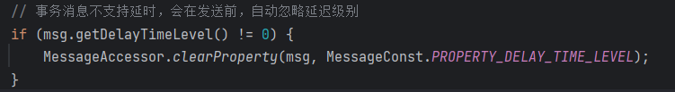


Broker 端判断是否是事务消息的依据是通过 [PROPERTY_TRANSACTION_PREPARED](http://property_transaction_prepared/) 属性判断的，Producer 在发送消息前会进行设置。


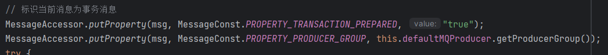


消息属性设置完毕，调用 send 方法同步发送给 Broker，并获取发送状态。


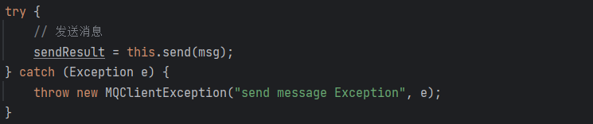


## **3.3  Half 消息存储过程**


[half 消息 ](http://xn--half  -0s4ti33j/)发送到 Broker，Broker 要负责存储，且此时消息对 Consumer 是不可见的，看看它是如何处理的。


在 [Broker](http://broker/) 对消息发送请求的处理在 [SendMessageProcessor](http://sendmessageprocessor/) 中，当 Broker 收到消息后，判断消息是否含有[PROPERTY_TRANSACTION_PREPARED](http://property_transaction_prepared/) 属性，如果含有 [prepared](http://prepared/) 属性，会转交给[TransactionalMessageService](http://transactionalmessageservice/) 进行处理，然后调用 [asyncPrepareMessage](http://asyncpreparemessage/) 对消息进行处理，普通消息直接转交给 [MessageStore](http://messagestore /) 处理， 如下图：


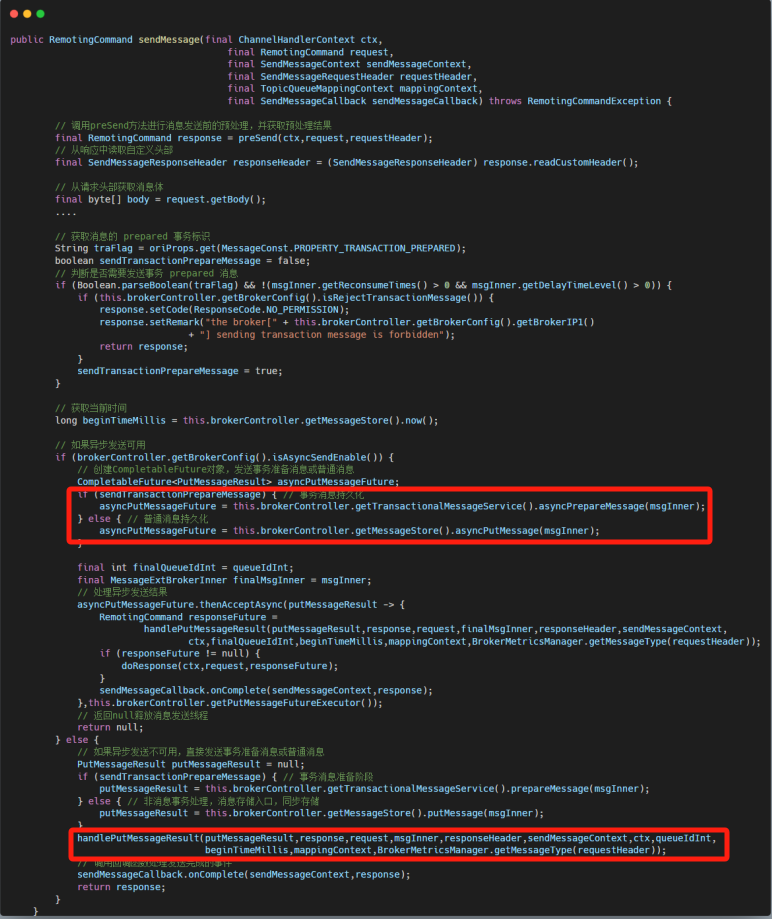


这里的重点是调用 [TransactionalMessageService#asyncPrepareMessage](http://transactionalmessageservice/#asyncPrepareMessage)，我们接着来剖析。


源码位置：[https://github.com/apache/rocketmq/blob/release-5.1.2/store/src/main/java/org/apache/rocketmq/](https://github.com/apache/rocketmq/blob/release-5.1.2/store/src/main/java/org/apache/rocketmq/broker/transaction/queue/TransactionalMessageServiceImpl.java)[broker/transaction/queue/TransactionalMessageServiceImpl.](https://github.com/apache/rocketmq/blob/release-5.1.2/store/src/main/java/org/apache/rocketmq/broker/transaction/queue/TransactionalMessageServiceImpl.java)[java](https://github.com/apache/rocketmq/blob/release-5.1.2/store/src/main/java/org/apache/rocketmq/broker/transaction/queue/TransactionalMessageServiceImpl.java)


### **3.3.1 异步处理 Prepare 消息**


```java

public class TransactionalMessageServiceImpl implements TransactionalMessageService {

    @Override
    public CompletableFuture<PutMessageResult> asyncPrepareMessage(MessageExtBrokerInner messageInner) {

       // 添加 half 消息
       return transactionalMessageBridge.asyncPutHalfMessage(messageInner);
   }
}
```


可以看到这里又调用了 [TransactionalMessageBridge#asyncPutHalfMessage](http://transactionalmessagebridge/#asyncPutHalfMessage) 方法来「**添加 half 消息**」。

###  **3.3.2 添加 Half 消息**


[TransactionalMessageService](http://transactionalmessageservice /) 使用了「**桥接模式**」，大部分操作会交给桥接类 [TransactionalMessageBridge](http://transactionalmessagebridge /) 执行。在处理 [Half消息](http://xn--half-ti4hr48d/) 时，为了不让 [Consumer](http://consumer/) 可见，会像处理延迟消息一样，改写 [Topic](http://topic/) 和 [queueId](http://queueid/)，将消息统一扔到 [RMQ_SYS_TRANS_HALF_TOPIC](http://rmq_sys_trans_half_topic/) 这个 [Topic](http://topic/) 下，默认的 [queueId](http://queueid/) 为 0。同时为了后续消息 [Commit](http://commit/) 时重新写入正常消息，必须将真实的 [Topic](http://topic/) 和 [queueId](http://queueid/) 等属性预先保留到 [Properties](http://properties/) 中。


```java

public class TransactionalMessageBridge {
    /**
     * 异步写入 Half 消息
          * @param messageInner
          * @return
               */
            public CompletableFuture<PutMessageResult> asyncPutHalfMessage(MessageExtBrokerInner messageInner) {
            // 异步添加消息
            return store.asyncPutMessage(parseHalfMessageInner(messageInner));
            }

    /**
     * 解析 Half 消息
          * @param msgInner
          * @return
               */
            private MessageExtBrokerInner parseHalfMessageInner(MessageExtBrokerInner msgInner) {
        // 计算唯一id
        String uniqId = msgInner.getUserProperty(MessageConst.PROPERTY_UNIQ_CLIENT_MESSAGE_ID_KEYIDX);
        if (uniqId != null && !uniqId.isEmpty()) {
               MessageAccessor.putProperty(msgInner, TransactionalMessageUtil.TRANSACTION_ID, uniqId);
        }
       // 真实的 Topic 和 queueId 存储到 Properties
        MessageAccessor.putProperty(msgInner, MessageConst.PROPERTY_REAL_TOPIC, msgInner.getTopic());
       MessageAccessor.putProperty(msgInner, MessageConst.PROPERTY_REAL_QUEUE_ID,
               String.valueOf(msgInner.getQueueId()));
        // 设置系统 flag
        msgInner.setSysFlag(
                MessageSysFlag.resetTransactionValue(msgInner.getSysFlag(), MessageSysFlag.TRANSACTION_NOT_TYPE));
       // 设置事务主题 RMQ_SYS_TRANS_HALF_TOPIC
        msgInner.setTopic(TransactionalMessageUtil.buildHalfTopic());
        // 设置事务队列ID
        msgInner.setQueueId(0);
        msgInner.setPropertiesString(MessageDecoder.messageProperties2String(msgInner.getProperties()));
       return msgInner;
            }
}
```

```java
public class TransactionalMessageUtil {
    public static String buildHalfTopic() {
        // half 消息主题
        return TopicValidator.RMQ_SYS_TRANS_HALF_TOPIC;
    }
}
```

```java
public class TopicValidator {
    public static final String RMQ_SYS_TRANS_HALF_TOPIC = "RMQ_SYS_TRANS_HALF_TOPIC";
}

```


在 [asyncPutHalfMessage](http://asyncputhalfmessage/) 方法中，调用了 [parseHalfMessageInner](http://parsehalfmessageinner/) 方法设置 [half 消息](http://xn--half -yn4n665g/) 的相关属性。

正因为是 [half 消息](http://xn--half-ti4hr48d/)，此时还「**不能直接加入**」到「**实际的消息队列**」中，否则一旦加入就会被消费者消费，所以需要先对 [half消息](http://xn--half-ti4hr48d/) 进行「**暂存**」，等收到消息提交请求时才可以添加到实际的消息队列中，在 RocketMQ 中设置了一个 [RMQ_SYS_TRANS_HALF_TOPIC](http://rmq_sys_trans_half_topic/) 主题来暂存 [half消息](http://xn--half-ti4hr48d/)。

来看下 [parseHalfMessageInner](http://parsehalfmessageinner/) 方法对消息进行的处理：

1. 设置消息实际的主题和队列 ID，待收到事务提交请求后恢复实际的主题和队列 ID，向实际的队列中添加消息。
2. 更改消息的主题为 half 消息主题 [RMQ_SYS_TRANS_HALF_TOPIC](http://rmq_sys_trans_half_topic/)，先将消息投送到 half 消息队列中。
3. half Topic 对应的消息队列 ID 为 0，所以更改消息的队列 ID 为 0。

消息的 [Topic](http://topic /) 被改写后，正常写入 [CommitLog](http://commitlog/)，但此时不会对 [Consumer](http://consumer/) 可见。之后调用 [asyncPutMessage](http://asyncputmessage/) 进行异步添加消息，接下来的流程就和普通消息的添加基本一致了，具体可点击：[【Broker端源码分析系列第十六篇】图解 RocketMQ 源码之 Broker MessageStore 存储架构](https://articles.zsxq.com/id_fon03obc0q26.html)。


## **3.4 提交事务状态过程**


Broker 将消息写入 [CommitLog](http://commitlog/) 后，会返回结果 [SendResult](http://sendresult/)，如果发送成功，[Producer](http://producer/) 开始执行本地事务：


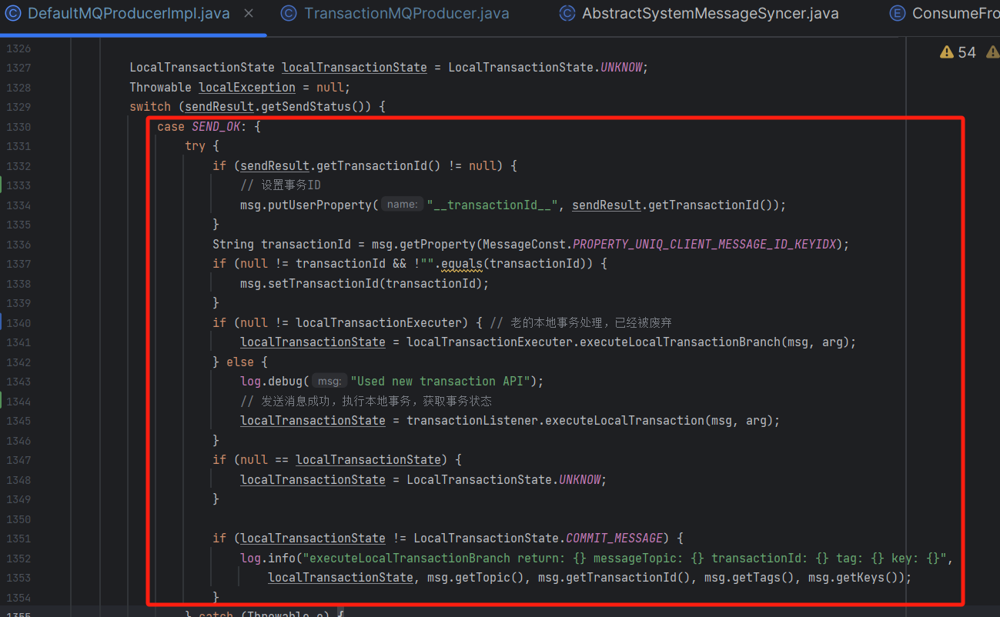


在进行了 [half消息](http://xn--half-ti4hr48d/) 「**发送**」和「**执行本地事务**」的操作后，消息暂存在 Broker 的 [half主题](http://xn--half-3h5fu250b/) 中，接下来生产者需要根据本地事务的执行状态结果 [LocalTransactionState](http://localtransactionstate/)，向 Broker 发送结束事务的请求，结束事务的方法 [endTransaction](http://endtransaction/) 也是在 [DefaultMQProducerImpl](http://defaultmqproducerimpl/) 中实现。


### **3.4.1 生产者发送结束事务消息**


先根据 [MessageQueue](http://messagequeue /) 找到 Broker 的主机地址，然后构建提交事务请求头 [EndTransactionRequestHeader](http://endtransactionrequestheader /) 并设置相关属性，请求头属性如下：


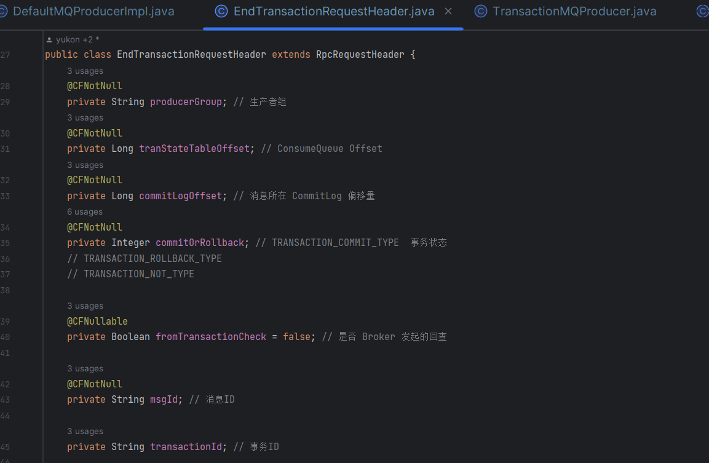


事务状态 [commitOrRollback](http://commitorrollback /) 用数字表示，8 代表 [Commit](http://commit/)、12 代表 [Rollback](http://rollback/)、0 代表未知状态。请求头构建好以后，通过 [Netty](http://netty/) 发送数据包给 Broker，对应的 [RequestCode](http://requestcode/) 为 [END_TRANSACTION](http://end_transaction/)。


```java

public class DefaultMQProducerImpl implements MQProducerInner {
    /**
     * 结束事务消息
          * @param msg
          * @param sendResult
               * @param localTransactionState
               * @param localException
                    * @throws RemotingException
                    * @throws MQBrokerException
                         * @throws InterruptedException
                         * @throws UnknownHostException
                              */
                        public void endTransaction(
        final Message msg,
        final SendResult sendResult,
        final LocalTransactionState localTransactionState,
        final Throwable localException) throws RemotingException, MQBrokerException, InterruptedException, UnknownHostException {
        // 消息
        final MessageId id;
        // 解析 MessageId，内含消息 Offset
        if (sendResult.getOffsetMsgId() != null) {
                            id = MessageDecoder.decodeMessageId(sendResult.getOffsetMsgId());
        } else {
                            id = MessageDecoder.decodeMessageId(sendResult.getMsgId());
        }
        // 获取事务ID
        String transactionId = sendResult.getTransactionId();
        final String destBrokerName = this.mQClientFactory.getBrokerNameFromMessageQueue(defaultMQProducer.queueWithNamespace(sendResult.getMessageQueue()));
        // 获取 MessageQueue 所在 Broker 的 Master 主机地址
        final String brokerAddr = this.mQClientFactory.findBrokerAddressInPublish(destBrokerName);
        // 创建结束事务请求头
        EndTransactionRequestHeader requestHeader = new EndTransactionRequestHeader();
        // 设置事务ID
        requestHeader.setTransactionId(transactionId);
        // 设置 commitLog 偏移量
        requestHeader.setCommitLogOffset(id.getOffset());
        // 设置 broker name
        requestHeader.setBname(destBrokerName);
        // 设置本地事务状态
        switch (localTransactionState) {
                            case COMMIT_MESSAGE: // 提交事务消息
                requestHeader.setCommitOrRollback(MessageSysFlag.TRANSACTION_COMMIT_TYPE);
                break;
                            case ROLLBACK_MESSAGE: // 提交事务消息
                requestHeader.setCommitOrRollback(MessageSysFlag.TRANSACTION_ROLLBACK_TYPE);
                break;
                            case UNKNOW: // 未知
                requestHeader.setCommitOrRollback(MessageSysFlag.TRANSACTION_NOT_TYPE);
                break;
                            default:
                break;
        }
    
        doExecuteEndTransactionHook(msg, sendResult.getMsgId(), brokerAddr, localTransactionState, false);
        requestHeader.setProducerGroup(this.defaultMQProducer.getProducerGroup());
        requestHeader.setTranStateTableOffset(sendResult.getQueueOffset());
        requestHeader.setMsgId(sendResult.getMsgId());
        String remark = localException != null ? ("executeLocalTransactionBranch exception: " + localException.toString()) : null;
        // 发送结束事务的请求
        this.mQClientFactory.getMQClientAPIImpl().endTransactionOneway(brokerAddr, requestHeader, remark, this.defaultMQProducer.getSendMsgTimeout());
        }
}
```


1. 构建结束事务的请求头 [EndTransactionRequestHeader](http://endtransactionrequestheader/)。
2. 判断本地事务执行状态：
3. [COMMIT_MESSAGE](http://commit_message/)：表示提交事务，结束事务的请求头中设置 [TRANSACTION_COMMIT_TYPE](http://transaction_commit_type/) 标识进行事务提交。
4. [ROLLBACK_MESSAGE](http://rollback_message/)：表示回滚事务，请求头中设置 [TRANSACTION_ROLLBACK_TYPE](http://transaction_rollback_type/) 标识进行事务回滚。
5. [UNKNOW](http://unknow/)：事务执行结果未知状态，请求头中设置 [TRANSACTION_NOT_TYPE](http://transaction_not_type/) 标识未知状态的事务。
6. 最后调用 [endTransactionOneway](http://endtransactiononeway/) 向 Broker 发送结束事务的请求。


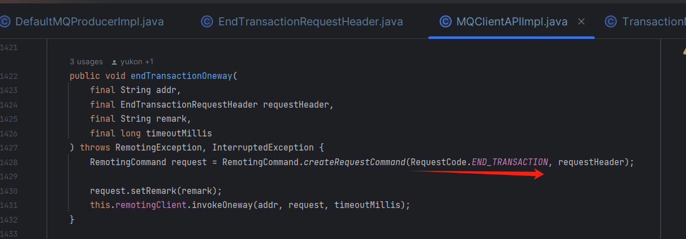


## **3.5  处理事务状态过程**


源码位置：[https://github.com/apache/rocketmq/blob/release-5.1.2/store/src/main/java/org/apache/rocketmq/](https://github.com/apache/rocketmq/blob/release-5.1.2/store/src/main/java/org/apache/rocketmq/broker/processor/EndTransactionProcessor.java)[broker/processor/EndTransactionProcessor.](https://github.com/apache/rocketmq/blob/release-5.1.2/store/src/main/java/org/apache/rocketmq/broker/processor/EndTransactionProcessor.java)[java](https://github.com/apache/rocketmq/blob/release-5.1.2/store/src/main/java/org/apache/rocketmq/broker/processor/EndTransactionProcessor.java)


Broker 端通过 [EndTransactionProcessor](http://endtransactionprocessor /) 类来处理 [Producer](http://producer /) 提交的事务请求。


```java

/**
 * Broker 端处理结束事务请求
 * @param ctx
 * @param request
 * @return
 * @throws RemotingCommandException
 */
  @Override
  public RemotingCommand processRequest(ChannelHandlerContext ctx, RemotingCommand request) throws
    RemotingCommandException {
    // 创建结束事务响应
    final RemotingCommand response = RemotingCommand.createResponseCommand(null);
    // 解析结束事务请求头
    final EndTransactionRequestHeader requestHeader =
        (EndTransactionRequestHeader) request.decodeCommandCustomHeader(EndTransactionRequestHeader.class);
    LOGGER.debug("Transaction request:{}", requestHeader);
    // 如果是从节点，从节点没有结束事务的权限，返回 SLAVE_NOT_AVAILABLE
    if (BrokerRole.SLAVE == brokerController.getMessageStoreConfig().getBrokerRole()) {
        response.setCode(ResponseCode.SLAVE_NOT_AVAILABLE);
        LOGGER.warn("Message store is slave mode, so end transaction is forbidden. ");
        return response;
    }
    // 请求头处理
    if (requestHeader.getFromTransactionCheck()) {
        // 根据提交或回滚的标记进行不同的处理
        switch (requestHeader.getCommitOrRollback()) {
            // 如果标记为等待确认类型的话，记录警告日志
            case MessageSysFlag.TRANSACTION_NOT_TYPE: {
                LOGGER.warn("Check producer[{}] transaction state, but it's pending status."
                        + "RequestHeader: {} Remark: {}",
                                    RemotingHelper.parseChannelRemoteAddr(ctx.channel()),
                                    requestHeader.toString(),
                                    request.getRemark());
                            return null;
                    }
                    // 如果标记为提交类型的话，记录警告日志
                    case MessageSysFlag.TRANSACTION_COMMIT_TYPE: {
                            LOGGER.warn("Check producer[{}] transaction state, the producer commit the message."
                                            + "RequestHeader: {} Remark: {}",
                                                    RemotingHelper.parseChannelRemoteAddr(ctx.channel()),
                                                    requestHeader.toString(),
                                                    request.getRemark());

                break;
            }
            // 如果标记为回滚类型的话，记录警告日志
            case MessageSysFlag.TRANSACTION_ROLLBACK_TYPE: {
                LOGGER.warn("Check producer[{}] transaction state, the producer rollback the message."
                        + "RequestHeader: {} Remark: {}",
                                    RemotingHelper.parseChannelRemoteAddr(ctx.channel()),
                                    requestHeader.toString(),
                                    request.getRemark());
                            break;
                    }
                    default:
                            return null;
            }
                    } else {
            // 根据提交或回滚的标记进行不同的处理
            switch (requestHeader.getCommitOrRollback()) {
                    // 如果标记为等待确认类型的话，记录警告日志
                    case MessageSysFlag.TRANSACTION_NOT_TYPE: {
                            LOGGER.warn("The producer[{}] end transaction in sending message,  and it's pending status."
                                            + "RequestHeader: {} Remark: {}",
                                                    RemotingHelper.parseChannelRemoteAddr(ctx.channel()),
                                                    requestHeader.toString(),
                                                    request.getRemark());
                                        return null;
                            }
                            // 对于提交类型的标记不进行任何处理
                            case MessageSysFlag.TRANSACTION_COMMIT_TYPE: {
                                        break;
                            }
                            // 如果标记为回滚类型的话，记录警告日志
                            case MessageSysFlag.TRANSACTION_ROLLBACK_TYPE: {
                                        LOGGER.warn("The producer[{}] end transaction in sending message, rollback the message."
                                                                + "RequestHeader: {} Remark: {}",
                                                                    RemotingHelper.parseChannelRemoteAddr(ctx.channel()),
                                                                    requestHeader.toString(),
                                                                    request.getRemark());
                                                    break;
                                    }
                                    default:
                                                    return null;
                    }
                                                    }
                                                    // 处理结果集
                                                    OperationResult result = new OperationResult();
                                                    // 判断事务提交类型，如果是提交事务
                                                    if (MessageSysFlag.TRANSACTION_COMMIT_TYPE == requestHeader.getCommitOrRollback()) {
                    // 提交事务消息
                    result = this.brokerController.getTransactionalMessageService().commitMessage(requestHeader);
                    if (result.getResponseCode() == ResponseCode.SUCCESS) {
                                    if (rejectCommitOrRollback(requestHeader, result.getPrepareMessage())) {
                                                    response.setCode(ResponseCode.ILLEGAL_OPERATION);
                                                    LOGGER.warn("Message commit fail [producer end]. currentTimeMillis - bornTime > checkImmunityTime, msgId={},commitLogOffset={}, wait check",
                                                                                    requestHeader.getMsgId(), requestHeader.getCommitLogOffset());
                                                    return response;
                                    }
                                    // 校验 Prepare 消息
                                    RemotingCommand res = checkPrepareMessage(result.getPrepareMessage(), requestHeader);
                                    if (res.getCode() == ResponseCode.SUCCESS) {
                                                    // 结束事务，创建新的Message，恢复真实的 Topic、queueId 等属性，重新写入 CommitLog
                                                    MessageExtBrokerInner msgInner = endMessageTransaction(result.getPrepareMessage());
                                                    msgInner.setSysFlag(MessageSysFlag.resetTransactionValue(msgInner.getSysFlag(), requestHeader.getCommitOrRollback()));
                                                    msgInner.setQueueOffset(requestHeader.getTranStateTableOffset());
                                                    msgInner.setPreparedTransactionOffset(requestHeader.getCommitLogOffset());
                                                    msgInner.setStoreTimestamp(result.getPrepareMessage().getStoreTimestamp());
                                                    MessageAccessor.clearProperty(msgInner, MessageConst.PROPERTY_TRANSACTION_PREPARED);
                                                     // 调用 sendFinalMessage 方法将消息重新写入 CommitLog
                                                     RemotingCommand sendResult = sendFinalMessage(msgInner);
                                                     if (sendResult.getCode() == ResponseCode.SUCCESS) {
                                                                     /**
                      * 事务消息提交，删除 Half 消息
                                       * Half消息不会真的被删除，通过写入 Op 消息来标记它被处理。
                                       */
                                       this.brokerController.getTransactionalMessageService().
                          deletePrepareMessage(result.getPrepareMessage());
                             }
                             return sendResult;
                     }
                     return res;
             }
    } else if (MessageSysFlag.TRANSACTION_ROLLBACK_TYPE == requestHeader.getCommitOrRollback()) { // 如果是回滚
             // 回滚事务消息，事实上没做任何处理
             result = this.brokerController.getTransactionalMessageService().rollbackMessage(requestHeader);
             if (result.getResponseCode() == ResponseCode.SUCCESS) {
                     if (rejectCommitOrRollback(requestHeader, result.getPrepareMessage())) {
                             response.setCode(ResponseCode.ILLEGAL_OPERATION);
                             LOGGER.warn("Message rollback fail [producer end]. currentTimeMillis - bornTime > checkImmunityTime, msgId={},commitLogOffset={}, wait check",
                         requestHeader.getMsgId(), requestHeader.getCommitLogOffset());
                             return response;
                     }
                     // 删除 half 消息
                     RemotingCommand res = checkPrepareMessage(result.getPrepareMessage(), requestHeader);
                     if (res.getCode() == ResponseCode.SUCCESS) {
                             // 写入 Op 消息，代表 Half 消息被处理
                             this.brokerController.getTransactionalMessageService().
                                     deletePrepareMessage(result.getPrepareMessage());
                     }
                     return res;
             }
    }
    // 设置响应 Code 和 Remark
    response.setCode(result.getResponseCode());
    response.setRemark(result.getResponseRemark());
    return response;
  }
```


处理逻辑如下：


1. 首先做校验确保是 [Master](http://master/) 节点处理该请求，因为 [Slave](http://slave/) 是没有写权限的（没有结束事务的权限），如果是从节点返回 [SLAVE_NOT_AVAILABLE](http://slave_not_available/)。
2. 解析请求头，从请求头中获取事务的提交类型：
3. [TRANSACTION_COMMIT_TYPE](http://transaction_commit_type/)：表示提交事务，会调用 [commitMessage](http://commitmessage/) 方法提交消息，如果提交成功根据请求头里的 [CommitLogOffset](http://commitlogoffset /) 读取出完整的消息，从 [Properties](http://properties /) 中恢复消息真实的 [Topic](http://topic/)、[queueId](http://queueid /) 等属性，再调用 [sendFinalMessage](http://sendfinalmessage /) 方法将消息重新写入 [CommitLog](http://commitlog/)，稍后构建好 [ConsumeQueue](http://consumequeue /) 消息对 [Consumer](http://consumer /) 就可见了，最后调用 [deletePrepareMessage](http://deletepreparemessage/) 方法删除  [half 消息](http://xn--half-ti4hr48d/)。
4. [TRANSACTION_ROLLBACK_TYPE](http://transaction_rollback_type/)：表示回滚事务，会调用 [rollbackMessage](http://rollbackmessage/) 方法回滚事务，处理就更加简单了，因为消息本来就对 Consumer 是不可见的，然后删掉 [half 消息](http://xn--half-ti4hr48d/)。


### **3.5.1 删除 Half 消息**


实际上，[half 消息](http://xn--half -yn4n665g/) 并不会删除，因为 [CommitLog](http://commitlog/) 是顺序追加写的，不可能删除单个消息。「**删除 half 消息**」仅仅是给该消息打上一个标记，代表它的最终状态已知，不需要再回查了。


RocketMQ 通过引入 Op 消息来给 [half 消息](http://xn--half -yn4n665g/) 打标记，[half 消息](http://xn--half -yn4n665g/) 状态确认后，会写入「**已经提交**」/「**回滚**」这样一条消息到 [Op队列](http://xn--op-nf5c439w/)，对应的Topic 为 [MQ_SYS_TRANS_OP_HALF_TOPIC](http://mq_sys_trans_op_half_topic/)，反之 [Op 队列](http://xn--op-nf5c439w/) 中不存在的，就是状态未确认，需要回查的 [half 消息](http://xn--half -yn4n665g/)。


```java

/**

 * 删除 half 消息

 * @param messageExt 扩展消息

 * @return

 */

@Override
public boolean deletePrepareMessage(MessageExt messageExt) {

     // 从 messageExt 中获取消息队列的 ID

     Integer queueId = messageExt.getQueueId();

     // 从 deleteContext 中获取消息队列操作上下文对象

     MessageQueueOpContext mqContext = deleteContext.get(queueId);

     // 如果消息队列操作上下文对象为空，则创建一个新的对象，并尝试将其放入 deleteContext 中

     if (mqContext == null) {

         mqContext = new MessageQueueOpContext(System.currentTimeMillis(), 20000);

         MessageQueueOpContext old = deleteContext.putIfAbsent(queueId, mqContext);

         if (old != null) {

             mqContext = old;

         }

     }

     // 构建要存储的数据，包括消息队列偏移量和事务消息的偏移量分隔符

     String data = messageExt.getQueueOffset() + TransactionalMessageUtil.OFFSET_SEPARATOR;

     try {

         // 将数据加入到消息队列操作上下文的队列中，设置超时时间为 100 毫秒

         boolean res = mqContext.getContextQueue().offer(data, 100, TimeUnit.MILLISECONDS);

         if (res) {

             // 增加消息队列操作上下文的总大小，并检查是否超过最大限制，如果超过则唤醒事务操作批处理服务

             int totalSize = mqContext.getTotalSize().addAndGet(data.length());

             if (totalSize > transactionalMessageBridge.getBrokerController().getBrokerConfig().getTransactionOpMsgMaxSize()) {

                 this.transactionalOpBatchService.wakeup();

             }

             return true;

         } else {

             // 如果加入失败，则唤醒事务操作批处理服务

             this.transactionalOpBatchService.wakeup();

         }

     } catch (InterruptedException ignore) {

     }

     // 获取代表事务操作的消息对象

     Message msg = getOpMessage(queueId, data);

     // 添加到 OP 消息队列

     if (this.transactionalMessageBridge.writeOp(queueId, msg)) {

         log.warn("Force add remove op data. queueId={}", queueId);

         return true;

     } else {

         log.error("Transaction op message write failed. messageId is {}, queueId is {}", messageExt.getMsgId(), messageExt.getQueueId());

         return false;

     }

}
```


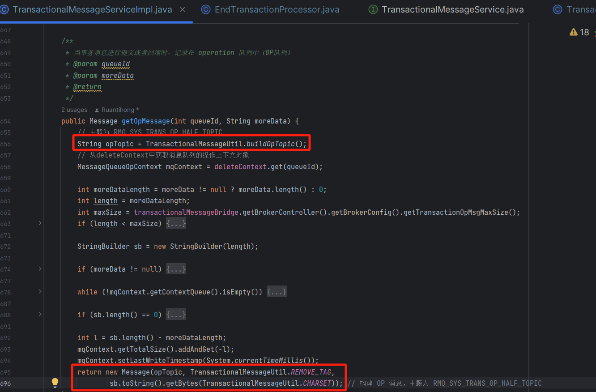


源码位置：[https://github.com/apache/rocketmq/blob/release-5.1.2/store/src/main/java/org/apache/rocketmq/](https://github.com/apache/rocketmq/blob/release-5.1.2/store/src/main/java/org/apache/rocketmq/broker/transaction\queue\TransactionalMessageBridge.java)[broker/transaction\queue\TransactionalMessageBridge.](https://github.com/apache/rocketmq/blob/release-5.1.2/store/src/main/java/org/apache/rocketmq/broker/transaction\queue\TransactionalMessageBridge.java)[java](https://github.com/apache/rocketmq/blob/release-5.1.2/store/src/main/java/org/apache/rocketmq/broker/transaction\queue\TransactionalMessageBridge.java)


```java

public class TransactionalMessageBridge {
    private final ConcurrentHashMap<Integer, MessageQueue> opQueueMap = new ConcurrentHashMap<>();
     
     /**
     * 写入 op 消息
          * @param queueId
          * @param message
               * @return
               */
            public boolean writeOp(Integer queueId,Message message) {
        // 通过 queueId 从 opQueueMap 中获取对应的消息队列对象
        MessageQueue opQueue = opQueueMap.get(queueId);
        // 如果未获取到消息队列对象，则尝试创建一个新的消息队列对象并放入 opQueueMap 中
        if (opQueue == null) {
                opQueue = getOpQueueByHalf(queueId,this.brokerController.getBrokerConfig().getBrokerName());
                MessageQueue oldQueue = opQueueMap.putIfAbsent(queueId,opQueue);
                if (oldQueue != null) {
                opQueue = oldQueue;
                }
        }
    
        // 构建事务操作消息，将消息写入 OP 队列，获取消息存储结果
        PutMessageResult result = putMessageReturnResult(makeOpMessageInner(message,opQueue));
        // 如果消息存储结果不为空且存储状态为 PUT_OK，则返回 true，表示写入成功
        if (result != null && result.getPutMessageStatus() == PutMessageStatus.PUT_OK) {
            return true;
        }
    
        // 如果写入失败，则返回 false
        return false;
        }

     /**
      * 构建 op 消息
           * @param message
           * @param messageQueue
                * @return
                */
             private MessageExtBrokerInner makeOpMessageInner(Message message,MessageQueue messageQueue) {
         // 创建一个内部消息对象
         MessageExtBrokerInner msgInner = new MessageExtBrokerInner();
         // 设置消息的主题
         msgInner.setTopic(message.getTopic());
         // 设置消息的内容
         msgInner.setBody(message.getBody());
         // 设置消息的队列ID
         msgInner.setQueueId(messageQueue.getQueueId());
         // 设置消息的标签
         msgInner.setTags(message.getTags());
         // 将消息标签转换为标签码
         msgInner.setTagsCode(MessageExtBrokerInner.tagsString2tagsCode(msgInner.getTags()));
         // 设置消息的系统标记
         msgInner.setSysFlag(0);
         // 设置消息的属性
         MessageAccessor.setProperties(msgInner,message.getProperties());
         // 将消息的属性转换为字符串
         msgInner.setPropertiesString(MessageDecoder.messageProperties2String(message.getProperties()));
         // 设置消息的生产时间戳
         msgInner.setBornTimestamp(System.currentTimeMillis());
         // 设置消息的生产主机
         msgInner.setBornHost(this.storeHost);
         // 设置消息的存储主机
         msgInner.setStoreHost(this.storeHost);
         // 设置是否等待消息存储结果
         msgInner.setWaitStoreMsgOK(false);
         // 设置消息的唯一ID
         MessageClientIDSetter.setUniqID(msgInner);
         // 返回设置好的消息对象
         return msgInner;
             }
}
```


1. 构建 OP 消息，主要是创建 Message 对象，然后设置主题为 [RMQ_SYS_TRANS_OP_HALF_TOPIC](http://rmq_sys_trans_op_half_topic/)，设置 [half 消息](http://xn--half-ti4hr48d/) 在队列的偏移量。
2. 调用 [writeOp](http://writeop/) 方法将消息写入 OP 队列，[makeOpMessageInner](http://makeopmessageinner/) 方法用于构建消息体，然后调用[putMessageReturnResult](http://putmessagereturnresult/) 放将消息写入 [CommitLog](http://commitlog/)。


## **3.6 事务状态检查**


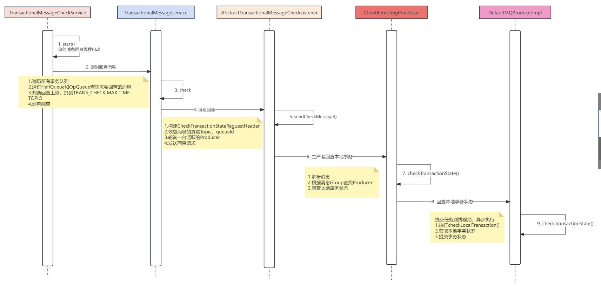


当 [half 消息](http://xn--half -yn4n665g/) 写入成功，可能由于各种原因没有收到 [Producer](http://producer/) 的事务状态「**已经提交**」/「**回滚**」请求。此时，Broker 会主动发起事务回查请求给 Producer，以决定最终将消息 Commit 还是 Rollback。


[half 消息](http://xn--half -yn4n665g/) 最终状态有没有被确认，是通过 [Op 队列](http://xn--op-nf5c439w/) 里的消息判断的。当 Broker 服务启动时，会开启[TransactionalMessageCheckService](http://transactionalmessagecheckservice/) 线程，它实现了 [ServiceThread](http://servicethread/) 默认可以看到在 [onWaitEnd](http://onwaitend/) 方法中调用了 [check](http://check/) 方法进行状态检查。


每隔 60 秒进行一次 [half 消息](http://xn--half-ti4hr48d/) 状态回查。为了避免消息被无限次的回查，RocketMQ 通过 [transactionCheckMax](http://transactioncheckmax /) 属性设置消息回查的最大次数，默认是 15 次。


```java

public class TransactionalMessageCheckService extends ServiceThread {

     @Override

     protected void onWaitEnd() {

         // 回查超时

         long timeout = brokerController.getBrokerConfig().getTransactionTimeOut();

         // 回查最大次数

         int checkMax = brokerController.getBrokerConfig().getTransactionCheckMax();

         long begin = System.currentTimeMillis();

         log.info("Begin to check prepare message, begin time:{}", begin);

         // 开始回查

         this.brokerController.getTransactionalMessageService().check(timeout, checkMax, this.brokerController.getTransactionalMessageCheckListener());

         log.info("End to check prepare message, consumed time:{}", System.currentTimeMillis() - begin);

     }

}


通过追踪得出 [check](http://check /) 方法在 [TransactionalMessageServiceImpl](http://transactionalmessageserviceimpl/) 中实现：


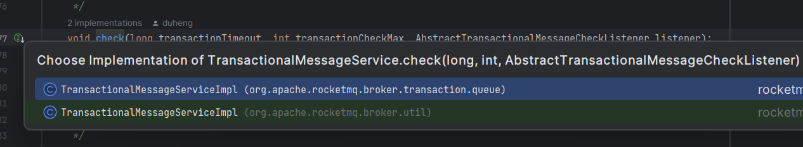


回查 [Half消息](http://xn--half-ti4hr48d/) 时，首先要获取 [Half 主题](http://xn--half-3h5fu250b/) 下的所有消息队列。


public class TransactionalMessageServiceImpl implements TransactionalMessageService {
    /**
     * 事务回查
          * @param transactionTimeout The minimum time of the transactional message to be checked firstly, one message only
          * exceed this time interval that can be checked.
               * @param transactionCheckMax The maximum number of times the message was checked, if exceed this value, this
               * message will be discarded.
                    * @param listener When the message is considered to be checked or discarded, the relative method of this class will
                    * be invoked.
                         */
                    @Override
                    public void check(long transactionTimeout, int transactionCheckMax,
        AbstractTransactionalMessageCheckListener listener) {
        try {
                        // half 消息对应的 Topic
                        String topic = TopicValidator.RMQ_SYS_TRANS_HALF_TOPIC;
                        // 根据主题获取消息队列
                        Set<MessageQueue> msgQueues = transactionalMessageBridge.fetchMessageQueues(topic);
                        if (msgQueues == null || msgQueues.size() == 0) {
                log.warn("The queue of topic is empty :" + topic);
                return;
                        }
                        log.debug("Check topic={}, queues={}", topic, msgQueues);
                        // 遍历所有的消息队列
                        for (MessageQueue messageQueue : msgQueues) {
                // 获取当前时间做为开始时间
                long startTime = System.currentTimeMillis();
                // 那么怎么判断消息需要回查呢？前面说过了，通过 Op 队列判断，因此还需要定位到 HalfQueue 对应的 OpQueue，以及它们的 ConsumeQueue 偏移量。
                // 获取对应的 OP 消息队列
                MessageQueue opQueue = getOpQueue(messageQueue);
                // 获取 half 消息队列的消费进度
                long halfOffset = transactionalMessageBridge.fetchConsumeOffset(messageQueue);
                // 获取 op 消息队列的消费进度
                long opOffset = transactionalMessageBridge.fetchConsumeOffset(opQueue);
                log.info("Before check, the queue={} msgOffset={} opOffset={}", messageQueue, halfOffset, opOffset);
                // 如果消费进度小于 0 表示不合法
                if (halfOffset < 0 || opOffset < 0) {
                            log.error("MessageQueue: {} illegal offset read: {}, op offset: {},skip this queue", messageQueue, halfOffset, opOffset);
                            continue;
                }
                // 存储已处理的消息
                List<Long> doneOpOffset = new ArrayList<>();
                HashMap<Long, Long> removeMap = new HashMap<>();
                HashMap<Long, HashSet<Long>> opMsgMap = new HashMap<Long, HashSet<Long>>();
                // 根据当前的消费进度从已处理队列中拉取消息
                PullResult pullResult = fillOpRemoveMap(removeMap, opQueue, opOffset, halfOffset, opMsgMap, doneOpOffset);
                if (null == pullResult) {
                            // 如果拉取消息为空，打印错误继续处理下一个消息队列
                            log.error("The queue={} check msgOffset={} with opOffset={} failed, pullResult is null", messageQueue, halfOffset, opOffset);
                            continue;
                }
                // single thread
                // 获取消息为空的数量默认为1
                int getMessageNullCount = 1;
                // 新的进度
                long newOffset = halfOffset;
                // 获取 half 队列的消费进度，赋值给i
                long i = halfOffset;
                // 获取下一个待处理的 op 消息队列的消费进度
                long nextOpOffset = pullResult.getNextBeginOffset();
                int putInQueueCount = 0;
                int escapeFailCnt = 0;

                while (true) {
                    // 如果当前时间减去开始时间大于最大处理时间限制，终止循环
                    if (System.currentTimeMillis() - startTime > MAX_PROCESS_TIME_LIMIT) {
                        log.info("Queue={} process time reach max={}", messageQueue, MAX_PROCESS_TIME_LIMIT);
                        break;
                    }
                    // 如果 OP 队列中包含当前偏移量，表示消息已经被处理，加入到已处理集合中
                    if (removeMap.containsKey(i)) {
                        log.debug("Half offset {} has been committed/rolled back", i);
                        Long removedOpOffset = removeMap.remove(i);
                        opMsgMap.get(removedOpOffset).remove(i);
                        if (opMsgMap.get(removedOpOffset).size() == 0) {
                            // 从集合中进行删除
                            opMsgMap.remove(removedOpOffset);
                            // 加入到 doneOpOffset 集合中
                            doneOpOffset.add(removedOpOffset);
                        }
                    } else { // 如果已处理队列中不包含当前消息
                        // 根据偏移量从 half 队列获取 half 消息
                        GetResult getResult = getHalfMsg(messageQueue, i);
                        // 获取消息对象
                        MessageExt msgExt = getResult.getMsg();
                        // 如果获取消息为空
                        if (msgExt == null) {
                            // 判断获取空消息的次数是否大于 MAX_RETRY_COUNT_WHEN_HALF_NULL
                            if (getMessageNullCount++ > MAX_RETRY_COUNT_WHEN_HALF_NULL) {
                                break;
                            }
                            // 判断从 half 队列获取消息的结果是 NO_NEW_MSG，表示没有消息，此时终止循环等待下一次进行检查
                            if (getResult.getPullResult().getPullStatus() == PullStatus.NO_NEW_MSG) {
                                log.debug("No new msg, the miss offset={} in={}, continue check={}, pull result={}", i, messageQueue, getMessageNullCount, getResult.getPullResult());
                                break;
                            } else {
                                log.info("Illegal offset, the miss offset={} in={}, continue check={}, pull result={}", i, messageQueue, getMessageNullCount, getResult.getPullResult());
                                // 执行到这里说明消息的偏移量不合法，继续获取下一条消息进行处理
                                i = getResult.getPullResult().getNextBeginOffset();
                                newOffset = i;
                                continue;
                            }
                        }
    
                         if (this.transactionalMessageBridge.getBrokerController().getBrokerConfig().isEnableSlaveActingMaster()
                             && this.transactionalMessageBridge.getBrokerController().getMinBrokerIdInGroup()
                             == this.transactionalMessageBridge.getBrokerController().getBrokerIdentity().getBrokerId()
                             && BrokerRole.SLAVE.equals(this.transactionalMessageBridge.getBrokerController().getMessageStoreConfig().getBrokerRole())
                         ) {
                             final MessageExtBrokerInner msgInner = this.transactionalMessageBridge.renewHalfMessageInner(msgExt);
                             final boolean isSuccess = this.transactionalMessageBridge.escapeMessage(msgInner);
    
                             if (isSuccess) {
                                 escapeFailCnt = 0;
                                 newOffset = i + 1;
                                 i++;
                             } else {
                                 log.warn("Escaping transactional message failed {} times! msgId(offsetId)={}, UNIQ_KEY(transactionId)={}",
                                     escapeFailCnt + 1,
                                     msgExt.getMsgId(),
                                     msgExt.getUserProperty(MessageConst.PROPERTY_UNIQ_CLIENT_MESSAGE_ID_KEYIDX));
                                 if (escapeFailCnt < MAX_RETRY_TIMES_FOR_ESCAPE) {
                                     escapeFailCnt++;
                                     Thread.sleep(100L * (2 ^ escapeFailCnt));
                                 } else {
                                     escapeFailCnt = 0;
                                     newOffset = i + 1;
                                     i++;
                                 }
                             }
                             continue;
                         }
                         // 是否需要丢弃消息或者需要跳过消息
                         if (needDiscard(msgExt, transactionCheckMax) || needSkip(msgExt)) {
                             // 回查次数超过 15，丢弃消息，扔到 TRANS_CHECK_MAX_TIME_TOPIC
                             listener.resolveDiscardMsg(msgExt);
                             // 继续处理下一条消息
                             newOffset = i + 1;
                             i++;
                             continue;
                         }
                         // 如果消息的添加时间是否大于等于本次检查的开始时间，说明是在检查开始之后加入的消息，暂不进行处理
                         if (msgExt.getStoreTimestamp() >= startTime) {
                             log.debug("Fresh stored. the miss offset={}, check it later, store={}", i,
                                 new Date(msgExt.getStoreTimestamp()));
                             break;
                         }
                         // 计算 half 消息在队列中的保留时间：当前时间减去消息加入的时间
                         long valueOfCurrentMinusBorn = System.currentTimeMillis() - msgExt.getBornTimestamp();
                         // 事务超时时间
                         long checkImmunityTime = transactionTimeout;
                         // 获取 PROPERTY_CHECK_IMMUNITY_TIME_IN_SECONDS 属性，表示事务回查最晚的时间
                         String checkImmunityTimeStr = msgExt.getUserProperty(MessageConst.PROPERTY_CHECK_IMMUNITY_TIME_IN_SECONDS);
                         // 如果 PROPERTY_CHECK_IMMUNITY_TIME_IN_SECONDS 属性不为空
                         if (null != checkImmunityTimeStr) {
                             // 获取事务回查最晚检查时间，如果 checkImmunityTimeStr 为 -1 则返回事务超时时间，
                             // 否则返回 checkImmunityTimeStr 转为 long 后乘以 1000 得到的值
                             checkImmunityTime = getImmunityTime(checkImmunityTimeStr, transactionTimeout);
                             // 如果消息的保留时间小于事务回查最晚检查时间
                             if (valueOfCurrentMinusBorn < checkImmunityTime) {
                                 // 检查 half 消息在队列中的偏移量，如果返回 true 跳过本条消息
                                 if (checkPrepareQueueOffset(removeMap, doneOpOffset, msgExt, checkImmunityTimeStr)) {
                                     // 处理下一个消息
                                     newOffset = i + 1;
                                     i++;
                                     continue;
                                 }
                             }
                         } else {
                             // 如果 valueOfCurrentMinusBorn 小于 checkImmunityTime
                             if (0 <= valueOfCurrentMinusBorn && valueOfCurrentMinusBorn < checkImmunityTime) {
                                 log.debug("New arrived, the miss offset={}, check it later checkImmunity={}, born={}", i,
                                     checkImmunityTime, new Date(msgExt.getBornTimestamp()));
                                 break;
                             }
                         }
                         // 获取 OP 消息
                         List<MessageExt> opMsg = pullResult == null ? null : pullResult.getMsgFoundList();
                         // 判断是否需要检查，满足检查的条件为以下三种情况之一：
                         // 1.拉取消息为空 && 消息的保留时间已经大于事务设置的最晚回查时间
                         // 2.拉取消息不为空 && 拉取到的最后一条消息的存入时间减去当前时间超过了事务的超时时间
                         // 3.half 消息存留时间为负数
                         boolean isNeedCheck = opMsg == null && valueOfCurrentMinusBorn > checkImmunityTime
                             || opMsg != null && opMsg.get(opMsg.size() - 1).getBornTimestamp() - startTime > transactionTimeout
                             || valueOfCurrentMinusBorn <= -1;
                         // 如果需要进行回查
                         if (isNeedCheck) {
                             // 将 half 消息重新加入到队列中
                             if (!putBackHalfMsgQueue(msgExt, i)) {
                                 continue;
                             }
                             putInQueueCount++;
                             log.info("Check transaction. real_topic={},uniqKey={},offset={},commitLogOffset={}",
                                     msgExt.getUserProperty(MessageConst.PROPERTY_REAL_TOPIC),
                                     msgExt.getUserProperty(MessageConst.PROPERTY_UNIQ_CLIENT_MESSAGE_ID_KEYIDX),
                                     msgExt.getQueueOffset(), msgExt.getCommitLogOffset());
                             // 发送回查请求
                             listener.resolveHalfMsg(msgExt);
                         } else {
                             nextOpOffset = pullResult != null ? pullResult.getNextBeginOffset() : nextOpOffset;
                             // 继续从 OP 队列中拉取消息
                             pullResult = fillOpRemoveMap(removeMap, opQueue, nextOpOffset,
                                     halfOffset, opMsgMap, doneOpOffset);
                             if (pullResult == null || pullResult.getPullStatus() == PullStatus.NO_NEW_MSG
                                     || pullResult.getPullStatus() == PullStatus.OFFSET_ILLEGAL
                                     || pullResult.getPullStatus() == PullStatus.NO_MATCHED_MSG) {
                                 try {
                                     Thread.sleep(SLEEP_WHILE_NO_OP);
                                 } catch (Throwable ignored) {
                                 }
                             } else {
                                 log.info("The miss message offset:{}, pullOffsetOfOp:{}, miniOffset:{} get more opMsg.", i, nextOpOffset, halfOffset);
                             }
                             continue;
                         }
                     }
                     // 加 1 继续处理下一条消息
                     newOffset = i + 1;
                     i++;
                }
                if (newOffset != halfOffset) {
                     // 更新消费进度
                     transactionalMessageBridge.updateConsumeOffset(messageQueue, newOffset);
                }
                long newOpOffset = calculateOpOffset(doneOpOffset, opOffset);
                if (newOpOffset != opOffset) {
                     // 更新处理进度
                     transactionalMessageBridge.updateConsumeOffset(opQueue, newOpOffset);
                }
                // 记录日志使用
                GetResult getResult = getHalfMsg(messageQueue, newOffset);
                pullResult = pullOpMsg(opQueue, newOpOffset, 1);
                long maxMsgOffset = getResult.getPullResult() == null ? newOffset : getResult.getPullResult().getMaxOffset();
                long maxOpOffset = pullResult == null ? newOpOffset : pullResult.getMaxOffset();
                long msgTime = getResult.getMsg() == null ? System.currentTimeMillis() : getResult.getMsg().getStoreTimestamp();
    
                log.info("After check, {} opOffset={} opOffsetDiff={} msgOffset={} msgOffsetDiff={} msgTime={} msgTimeDelayInMs={} putInQueueCount={}",
                        messageQueue, newOpOffset, maxOpOffset - newOpOffset, newOffset, maxMsgOffset - newOffset, new Date(msgTime),
                        System.currentTimeMillis() - msgTime, putInQueueCount);
                }
        } catch (Throwable e) {
                log.error("Check error", e);
        }
            }
}

```


方法很长，这里会获取 [RMQ_SYS_TRANS_HALF_TOPIC](http://rmq_sys_trans_half_topic/) 下的所有消息队列，遍历所有的 [half 消息](http://xn--half-ti4hr48d/)队列，对队列中的 [half 消息](http://xn--half-ti4hr48d/)进行处理，步骤比较多，我们分别来看下。


### **3.6.1 构建 OP 队列的 MessageQueue**


```java

/**

 * 构建 OP 队列的消息队列对象 MessageQueue

 * @param messageQueue

 * @return

 */

private MessageQueue getOpQueue(MessageQueue messageQueue) {

     // 获取 OP 消息队列

     MessageQueue opQueue = opQueueMap.get(messageQueue);

     if (opQueue == null) {

         // 如果获取为空，则创建 MessageQueue，主题设置为 OP TOPIC，设置 Broker 名称和队列 ID

         opQueue = new MessageQueue(TransactionalMessageUtil.buildOpTopic(), messageQueue.getBrokerName(),

             messageQueue.getQueueId());

         // 加入到 opQueueMap 中

         opQueueMap.put(messageQueue, opQueue);

     }

     return opQueue;

}
```


### **3.6.2 获取 Half 队列与 OP 消费队列的消费进度**


消费进度的获取是通过调用 [transactionalMessageBridge#fetchConsumeOffset](http:// transactionalmessagebridge/#fetchConsumeOffset) 方法进行查询的，可以看到方法的参数是 [MessageQueue](http://messagequeue/) 类型的，所以第一步需要构造 OP 队列的 [MessageQueue](http://messagequeue/) 对象，在这一步查询消费进度使用。


```java

/**

 * 获取 Half 队列与 OP 消费队列的消费进度

 * @param mq

 * @return

 */

public long fetchConsumeOffset(MessageQueue mq) {

     // 根据 topic、队列id、消费者组获取消费进度

     long offset = brokerController.getConsumerOffsetManager().queryOffset(TransactionalMessageUtil.buildConsumerGroup(),

         mq.getTopic(), mq.getQueueId());

     if (offset == -1) {

         // 如果没有设置为队列中最小的偏移量

         offset = store.getMinOffsetInQueue(mq.getTopic(), mq.getQueueId());

     }

     return offset;

}
```


### **3.6.3 从 OP 队列中拉取消息**


根据消费进度信息从 OP 队列中拉取消息，将拉取的消费放入 [removeMap](http://removemap/) 中，用于判断 [half 消息](http://xn--half-ti4hr48d/) 是否已经处理。


```java

/**
 * Read op message, parse op message, and fill removeMap
 * 从 OP 队列中拉取消息
 * @param removeMap Half message to be remove, key:halfOffset, value: opOffset.
 * @param opQueue Op message queue.
 * @param pullOffsetOfOp The begin offset of op message queue.
 * @param miniOffset The current minimum offset of half message queue.
 * @param opMsgMap Half message offset in op message
 * @param doneOpOffset Stored op messages that have been processed.
 * @return Op message result.
 */
  private PullResult fillOpRemoveMap(HashMap<Long, Long> removeMap, MessageQueue opQueue,
                                   long pullOffsetOfOp, long miniOffset, Map<Long, HashSet<Long>> opMsgMap, List<Long> doneOpOffset) {
    // 从OP队列中拉取消息，每次拉取 32 条
    PullResult pullResult = pullOpMsg(opQueue, pullOffsetOfOp, OP_MSG_PULL_NUMS);
    if (null == pullResult) {
        // 如果拉取为空返回 null
        return null;
    }
    // 如果拉取状态为消费进度不合法或者没有匹配的消息
    if (pullResult.getPullStatus() == PullStatus.OFFSET_ILLEGAL
        || pullResult.getPullStatus() == PullStatus.NO_MATCHED_MSG) {
        log.warn("The miss op offset={} in queue={} is illegal, pullResult={}", pullOffsetOfOp, opQueue,
            pullResult);
        // 从拉取结果中获取消费进度并更新消费进度
        transactionalMessageBridge.updateConsumeOffset(opQueue, pullResult.getNextBeginOffset());
        return pullResult;
    } else if (pullResult.getPullStatus() == PullStatus.NO_NEW_MSG) {
        log.warn("The miss op offset={} in queue={} is NO_NEW_MSG, pullResult={}", pullOffsetOfOp, opQueue,
            pullResult);
        return pullResult;
    }
    // 获取拉取到的消息
    List<MessageExt> opMsg = pullResult.getMsgFoundList();
    if (opMsg == null) {
        log.warn("The miss op offset={} in queue={} is empty, pullResult={}", pullOffsetOfOp, opQueue, pullResult);
        return pullResult;
    }
    // 遍历拉取的消息
    for (MessageExt opMessageExt : opMsg) {
        if (opMessageExt.getBody() == null) {
            log.error("op message body is null. queueId={}, offset={}", opMessageExt.getQueueId(),
                    opMessageExt.getQueueOffset());
            doneOpOffset.add(opMessageExt.getQueueOffset());
            continue;
        }
        HashSet<Long> set = new HashSet<Long>();
        // 构建队列进度消息体
        String queueOffsetBody = new String(opMessageExt.getBody(), TransactionalMessageUtil.CHARSET);

         log.debug("Topic: {} tags: {}, OpOffset: {}, HalfOffset: {}", opMessageExt.getTopic(),
                 opMessageExt.getTags(), opMessageExt.getQueueOffset(), queueOffsetBody);
         if (TransactionalMessageUtil.REMOVE_TAG.equals(opMessageExt.getTags())) {
             String[] offsetArray = queueOffsetBody.split(TransactionalMessageUtil.OFFSET_SEPARATOR);
             for (String offset : offsetArray) {
                 // 获取队列中的偏移量
                 Long offsetValue = getLong(offset);
                 // 如果偏移量小于最小的偏移量
                 if (offsetValue < miniOffset) {
                     continue;
                 }
                 // 加入到已处理消息的集合 removeMap 中
                 removeMap.put(offsetValue, opMessageExt.getQueueOffset());
                 set.add(offsetValue);
             }
         } else {
             log.error("Found a illegal tag in opMessageExt= {} ", opMessageExt);
         }

         if (set.size() > 0) {
             // 加入到已处理消息的集合 opMsgMap 中
             opMsgMap.put(opMessageExt.getQueueOffset(), set);
         } else {
             // 加入到 doneOpOffset 中
             doneOpOffset.add(opMessageExt.getQueueOffset());
         }
    }

    log.debug("Remove map: {}", removeMap);
    log.debug("Done op list: {}", doneOpOffset);
    log.debug("opMsg map: {}", opMsgMap);
    return pullResult;
  }
  
```


### **3.6.4 循环处理每一个 half 消息**


执行 [while](http://while /) 循环，从 [half 队列](http://xn--half -no0lh071c/)的消费进度处开始，处理每一个 [half 消息](http://xn--half -yn4n665g/)，处理逻辑如下：


1. 如果当前时间减去检查开始时间大于最大处理时间，此时终止循环。
2. 如果[removeMap](http://removemap/)中包含当前 [half 消息](http://xn--half-ti4hr48d/)，表示消息已经被处理，则放入到已处理消息集合中 [doneOpOffset](http://doneopoffset/)。
3. 如果 [removeMap](http://removemap/) 不包含当前 [half 消息](http://xn--half-ti4hr48d/)， 调用 [getHalfMsg](http://gethalfmsg/) 方法根据偏移量从 [half 队列](http://xn--half-8i9fi717a/)获取 [half 消息](http://xn--half-ti4hr48d/)，如果消息获取不为空继续下一步，否则进行如下处理：
4. 判断获取空消息的个数是否大于[MAX_RETRY_COUNT_WHEN_HALF_NULL](http://max_retry_count_when_half_null/)，如果大于将终止本次循环，处理下一个 [half 消息](http://xn--half-ti4hr48d/)队列。
5. 判断拉取消息的状态是否为[NO_NEW_MSG](http://no_new_msg/)，如果是表示队列中没有消息，先终止循环。
6. 如果拉取消息的状态是不是[NO_NEW_MSG](http://no_new_msg/)，表示消费进度不合法，获取half消息队列中下一条消息进行处理。
7. 调用 [needDiscard](http://needdiscard/) 判断是否需要丢弃 [half 消息](http://xn--half-ti4hr48d/)，或者调用 [needSkip](http://needskip/) 判断是否需要跳过当前 [half 消息](http://xn--half-ti4hr48d/)：
8. [needDiscard](http://needdiscard/) 是根据 [half 消息](http://xn--half-ti4hr48d/) 的检查次数是否超过最大限制来决定是否丢弃 [half 消息](http://xn--half-ti4hr48d/)。

```java

private boolean needDiscard(MessageExt msgExt, int transactionCheckMax) {

     // 从属性中获取检查次数

     String checkTimes = msgExt.getProperty(MessageConst.PROPERTY_TRANSACTION_CHECK_TIMES);

     int checkTime = 1;

     if (null != checkTimes) { // 如果不为空

         checkTime = getInt(checkTimes);

         if (checkTime >= transactionCheckMax) { // 如果检查次数大于事务最大的检查次数，表示需要丢弃

             return true;

         } else {

             // 检查次数加一

             checkTime++;

         }

     }

     // 更新检查次数

     msgExt.putUserProperty(MessageConst.PROPERTY_TRANSACTION_CHECK_TIMES, String.valueOf(checkTime));

     return false;

}

1. [needSkip](http://needskip/) 是根据 [half 消息](http://xn--half-ti4hr48d/) 在队列中的存留时间是否超过了最大的保留时间限制来决定是否跳过。

private boolean needSkip(MessageExt msgExt) {

     // 计算 half 消息在队列中的保留时间

     long valueOfCurrentMinusBorn = System.currentTimeMillis() - msgExt.getBornTimestamp();

     // 如果 half 消息在队列中的保留时间大于 Broker 中设置的最大保留时间，表示需要跳过

     if (valueOfCurrentMinusBorn

         \> transactionalMessageBridge.getBrokerController().getMessageStoreConfig().getFileReservedTime()

         \* 3600L * 1000) {

         log.info("Half message exceed file reserved time ,so skip it.messageId {},bornTime {}",

             msgExt.getMsgId(), msgExt.getBornTimestamp());

         return true;

     }

     return false;

}
```

1. 判断消息的的存入时间是否大于本次开始检查的时间，如果大于说明是新加入的消息，由于事务消息发送后不会立刻提交，所以此时暂不需要进行检查，中断循环即可。
2. 计算 [half 消息](http://xn--half-ti4hr48d/) 在队列中的存留时间 [valueOfCurrentMinusBorn](http://valueofcurrentminusborn/)：当前时间 - 消息存入的时间。
3. 设置立刻回查事务状态的时间 [checkImmunityTime](http://checkimmunitytime/)：事务的超时时间。
4. 从消息属性中获取 [PROPERTY_CHECK_IMMUNITY_TIME_IN_SECONDS](http://property_check_immunity_time_in_seconds/) 属性的值放在 [checkImmunityTimeStr](http://checkimmunitytimestr/) 中，表示事务的最晚回查时间：
5. 如果 [checkImmunityTimeStr](http://checkimmunitytimestr/) 获取不为空，调用 [getImmunityTime](http://getimmunitytime/) 方法计算事务立刻回查时间，并赋值给[checkImmunityTime](http://checkimmunitytime/)，从源码中可以看出如果 [checkImmunityTimeStr](http://checkimmunitytimestr/) 为 -1 则返回事务的超时时间，否则返回[checkImmunityTimeStr](http://checkimmunitytimestr/) 的值并乘以 [1000](http://0.0.3.232/) 转为秒。

```java

private long getImmunityTime(String checkImmunityTimeStr, long transactionTimeout) {

     long checkImmunityTime;

     // 转为 long

     checkImmunityTime = getLong(checkImmunityTimeStr);

     if (-1 == checkImmunityTime) { // 如果为-1，使用事务的超时时间

         checkImmunityTime = transactionTimeout;

     } else {

         checkImmunityTime *= 1000; // 使用 checkImmunityTime，乘以 1000 转为秒

     }

     return checkImmunityTime;

}
```

1. 计算完 [checkImmunityTime](http://checkimmunitytime/) 值后，判断 [valueOfCurrentMinusBorn](http://valueofcurrentminusborn/) 是否小于 [checkImmunityTime](http://checkimmunitytime/)，如果是表明还未到事务的超时时间，此时调用 [checkPrepareQueueOffset](http://checkpreparequeueoffset/) 检查 [half 消息](http://xn--half-ti4hr48d/)在队列中的偏移量，根据检查结果判断是否需要跳过当前消息：
2. 如果 [PROPERTY_TRANSACTION_PREPARED_QUEUE_OFFSET](http://property_transaction_prepared_queue_offset/) 属性获取为空，调用[putImmunityMsgBackToHalfQueue](http://putimmunitymsgbacktohalfqueue/) 将消息重新加入 [half 队列](http://xn--half-8i9fi717a/)，如果返回 true 表示加入成功，此时向前推荐消费进度处理下一条消息，如果加入失败会继续循环处理本条消息（此时进度未向前推进）。
3. 如果 [PROPERTY_TRANSACTION_PREPARED_QUEUE_OFFSET](http://property_transaction_prepared_queue_offset/) 属性获取不为空，转为 long 型，判断 [OP 队列](http://xn--op-nf5c439w/)中是否已经包含当前消息的偏移量，如果包含加入到 [doneOpOffset](http://doneopoffset/) 中并返回true，此时向前推进消费进度，处理下一条消息，否则同样调用 [putImmunityMsgBackToHalfQueue](http://putimmunitymsgbacktohalfqueue/) 将消息重新加入 [half 队列](http://xn--half-8i9fi717a/)，并根据加入成功与否判断是否继续处理下一条消息。
4. 如果事务设置了 [PROPERTY_CHECK_IMMUNITY_TIME_IN_SECONDS](http://property_check_immunity_time_in_seconds/) 属性，并且 [half 消息](http://xn--half-ti4hr48d/) 的存留时间小于立刻检查事务的时间，说明还未到时间不需要进行状态检查，此时获取消息在 [half 队列](http://xn--half-8i9fi717a/) 的偏移量，如果获取为空，将消息重新加入到 [half 队列](http://xn--half-8i9fi717a/) 中，如果获取不为空判断是否已经在 [OP 处理队列](http://xn--op-nf5cr6xzp0bo06b/) 中，如果返回 true处理下一个消息即可，否则同样将消息重新加入 [half 队列](http://xn--half-8i9fi717a/) 中。
5. RocketMQ 在事务未到最晚回查时间时将消息重新加入了 [half 消息队列](http://xn--half-8i9fu37eu4ueh8e/)，因为加入之后 [half 队列](http://xn--half-8i9fi717a/) 的消费进度会往前推进并在回查结束时更新进度，所以下次检查时并不会检查到旧的[half 消息](http://xn--half-ti4hr48d/)。

```java

private boolean checkPrepareQueueOffset(HashMap<Long, Long> removeMap, List<Long> doneOpOffset,

     MessageExt msgExt, String checkImmunityTimeStr) {

     // 从属性中获取消息在 half 队列的偏移量

     String prepareQueueOffsetStr = msgExt.getUserProperty(MessageConst.PROPERTY_TRANSACTION_PREPARED_QUEUE_OFFSET);

     if (null == prepareQueueOffsetStr) {

         // 将消息重新加入 half 队列

         return putImmunityMsgBackToHalfQueue(msgExt);

     } else {

         // 转为 long

         long prepareQueueOffset = getLong(prepareQueueOffsetStr);

         // 如果为 -1，返回 false，等待下次循环进行处理

         if (-1 == prepareQueueOffset) {

             return false;

         } else {

             // 如果 OP 队列中已经包含当前消息的偏移量

             if (removeMap.containsKey(prepareQueueOffset)) {

                 long tmpOpOffset = removeMap.remove(prepareQueueOffset);

                 // 加入到已完成的消息集合中

                 doneOpOffset.add(tmpOpOffset);

                 log.info("removeMap contain prepareQueueOffset. real_topic={},uniqKey={},immunityTime={},offset={}",

                         msgExt.getUserProperty(MessageConst.PROPERTY_REAL_TOPIC),

                         msgExt.getUserProperty(MessageConst.PROPERTY_UNIQ_CLIENT_MESSAGE_ID_KEYIDX),

                         checkImmunityTimeStr,

                         msgExt.getQueueOffset());

                 return true;

             } else {

                 // 将消息重新加入 half 队列

                 return putImmunityMsgBackToHalfQueue(msgExt);

             }

         }

     }

}
```

1. 如果 [checkImmunityTimeStr](http://checkimmunitytimestr/) 获取为空，判断 [valueOfCurrentMinusBorn](http://valueofcurrentminusborn/)（消息存留时间）是否大于等于 0并且小于 [checkImmunityTime](http://checkimmunitytime/)（事务超时时间），如果满足条件表示新加入的消息并且还未过事务的超时时间，此时终止循环暂不进行回查，否则进入下一步。
2. 判断是否需要进行状态回查 [isNeedCheck](http://isneedcheck/)，满足检查的条件为以下三种情况之一：
3. 从 [OP 队列](http://xn--op-nf5c439w/) 中拉取消息为空并且当前 [half 消息](http://xn--half-ti4hr48d/) 的存留时间已经大于事务设置的最晚回查时间。

opMsg == null && valueOfCurrentMinusBorn > checkImmunityTime

1. 从 [OP队列](http://xn--op-nf5c439w/) 中拉取的消息不为空，并且拉取的最后一条消息的存入时间减去本次开始检查时间大于事务的超时时间。

opMsg != null && opMsg.get(opMsg.size() - 1).getBornTimestamp() - startTime > transactionTimeout

1. [half 消息](http://xn--half-ti4hr48d/) 在队列中的保留时间小于等于1，说明加入[half 消息](http://xn--half-ti4hr48d/)的时间大于本次开始检查的时间。

valueOfCurrentMinusBorn <= -1

1.  根据 [isNeedCheck](http://isneedcheck /) 判断是否需要回查：
2. 需要回查：调用 [putBackHalfMsgQueue](http://putbackhalfmsgqueue/) 将 [half 消息](http://xn--half-ti4hr48d/) 重新加入到队列中，如果加入失败继续循环再次处理，如果加入成功调用 [resolveHalfMsg](http://resolvehalfmsg/) 发送回查请求。
3. 不需要回查：调用 [fillOpRemoveMap](http://fillopremovemap/) 继续从 [OP 队列](http://xn--op-nf5c439w/) 中拉取消息判断。
4. 最后更新 i 的值，继续处理下一个[half 消息](http://xn--half-ti4hr48d/)。


## **3.7 更新消费进度**


此处主要是更新「**Half 队列**」和「**OP 队列**」的消费进度。


### **3.7.1 重新添加 Half 消息到队列**


将消息重新加入到了[half 队列](http://xn--half-8i9fi717a/) 是在 [putBackHalfMsgQueue](http://putbackhalfmsgqueue /) 方法执行。


```java

/**
 * 重新添加 half 消息到队列中
 * @param msgExt
 * @param offset
 * @return
 */
  private boolean putBackHalfMsgQueue(MessageExt msgExt, long offset) {
    // 重新将消息入到 half 消息队列中
    PutMessageResult putMessageResult = putBackToHalfQueueReturnResult(msgExt);
    // 如果加入成功
    if (putMessageResult != null
        && putMessageResult.getPutMessageStatus() == PutMessageStatus.PUT_OK) {
        // 设置消息的逻辑偏移量
        msgExt.setQueueOffset(
            putMessageResult.getAppendMessageResult().getLogicsOffset());
        // 设置消息在 CommitLog 的偏移量
        msgExt.setCommitLogOffset(
            putMessageResult.getAppendMessageResult().getWroteOffset());
        // 设消息ID
        msgExt.setMsgId(putMessageResult.getAppendMessageResult().getMsgId());
        log.debug(
            "Send check message, the offset={} restored in queueOffset={} "
                + "commitLogOffset={} "
                            + "newMsgId={} realMsgId={} topic={}",
                    offset, msgExt.getQueueOffset(), msgExt.getCommitLogOffset(), msgExt.getMsgId(),
                    msgExt.getUserProperty(MessageConst.PROPERTY_UNIQ_CLIENT_MESSAGE_ID_KEYIDX),
                    msgExt.getTopic());
            return true;
    } else {
            // 加入失败
            log.error(
                    "PutBackToHalfQueueReturnResult write failed, topic: {}, queueId: {}, "
                            + "msgId: {}",
                            msgExt.getTopic(), msgExt.getQueueId(), msgExt.getMsgId());
                return false;
    }
  }
```


### **3.7.2 发送事务状态回查请求**

**
**向客户端发送事务状态回查的请求是在 [AbstractTransactionalMessageCheckListener#resolveHalfMsg](http://abstracttransactionalmessagechecklistener/#resolveHalfMsg) 方法执行，可以看到是通过线程池异步实现的，构建请求信息并向消息的生产者发送事务状态回查的请求。


```java

public abstract class AbstractTransactionalMessageCheckListener {

     private static final Logger LOGGER = LoggerFactory.getLogger(LoggerName.TRANSACTION_LOGGER_NAME);

     private BrokerController brokerController;

     //queue nums of topic TRANS_CHECK_MAX_TIME_TOPIC

     protected final static int TCMT_QUEUE_NUMS = 1;

     private static volatile ExecutorService executorService;

     public AbstractTransactionalMessageCheckListener() {

     }

     public AbstractTransactionalMessageCheckListener(BrokerController brokerController) {

         this.brokerController = brokerController;

     }

     public void sendCheckMessage(MessageExt msgExt) throws Exception {

         // 构建回查请求头

         CheckTransactionStateRequestHeader checkTransactionStateRequestHeader = new CheckTransactionStateRequestHeader();

         // 设置Commitlog偏移量

         checkTransactionStateRequestHeader.setCommitLogOffset(msgExt.getCommitLogOffset());

         // 设置偏移量消息id

         checkTransactionStateRequestHeader.setOffsetMsgId(msgExt.getMsgId());

         // 设置消息id

         checkTransactionStateRequestHeader.setMsgId(msgExt.getUserProperty(MessageConst.PROPERTY_UNIQ_CLIENT_MESSAGE_ID_KEYIDX));

         // 设置事务id

         checkTransactionStateRequestHeader.setTransactionId(checkTransactionStateRequestHeader.getMsgId());

         // 设置事务状态表偏移量

         checkTransactionStateRequestHeader.setTranStateTableOffset(msgExt.getQueueOffset());

         // 设置 brokername

         checkTransactionStateRequestHeader.setBname(brokerController.getBrokerConfig().getBrokerName());

         // 设置消息实际的TOPIC

         msgExt.setTopic(msgExt.getUserProperty(MessageConst.PROPERTY_REAL_TOPIC));

         // 设置消息实际的队列ID

         msgExt.setQueueId(Integer.parseInt(msgExt.getUserProperty(MessageConst.PROPERTY_REAL_QUEUE_ID)));

         // 设置存储大小

         msgExt.setStoreSize(0);

         String groupId = msgExt.getProperty(MessageConst.PROPERTY_PRODUCER_GROUP);

         // 获取channel

         Channel channel = brokerController.getProducerManager().getAvailableChannel(groupId);

         if (channel != null) {

             // 发送回查请求

             brokerController.getBroker2Client().checkProducerTransactionState(groupId, channel, checkTransactionStateRequestHeader, msgExt);

         } else {

             LOGGER.warn("Check transaction failed, channel is null. groupId={}", groupId);

         }

     }

     public void resolveHalfMsg(final MessageExt msgExt) {

         if (executorService != null) {

             executorService.execute(new Runnable() {

                 @Override

                 public void run() {

                     try {

                         // 发送状态回查请求

                         sendCheckMessage(msgExt);

                     } catch (Exception e) {

                         LOGGER.error("Send check message error!", e);

                     }

                 }

             });

         } else {

             LOGGER.error("TransactionalMessageCheckListener not init");

         }

     }

     public BrokerController getBrokerController() {

         return brokerController;

     }

     public void shutDown() {

         if (executorService != null) {

             executorService.shutdown();

         }

     }

     /**

      \* 初始化线程池

      */

     public synchronized void initExecutorService() {

         // 如果线程池为空，则创建新的线程池

         if (executorService == null) {

             // 创建一个线程池，初始线程数为 2，最大线程数为 5，空闲线程超过 100 秒会被回收

             // 使用数组阻塞队列作为任务队列，容量为 2000

             // 使用自定义的 ThreadFactory 创建线程，调用者运行的饱和策略

             executorService = new ThreadPoolExecutor(2,5,100,TimeUnit.SECONDS,new ArrayBlockingQueue<>(2000),

                     new ThreadFactoryImpl("Transaction-msg-check-thread",brokerController.getBrokerIdentity()),new CallerRunsPolicy());

         }

     }

     /**

      \* Inject brokerController for this listener

      *

      \* @param brokerController

      */

     public void setBrokerController(BrokerController brokerController) {

         this.brokerController = brokerController;

         initExecutorService();

     }

     /**

      \* In order to avoid check back unlimited, we will discard the message that have been checked more than a certain

      \* number of times.

      *

      \* @param msgExt Message to be discarded.

      */

     public abstract void resolveDiscardMsg(MessageExt msgExt);

}
```


### **3.7.3 处理事务状态回查请求**


事务状态回查请求的处理在 [ClientRemotingProcessor](http://clientremotingprocessor/) 中进行处理。


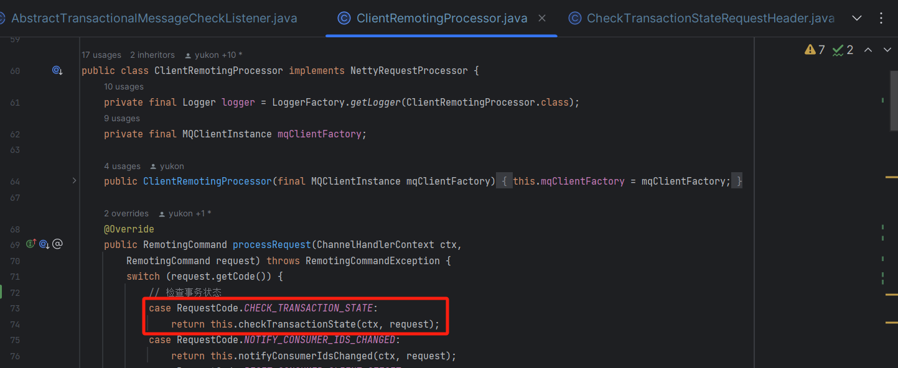


```java

public class ClientRemotingProcessor implements NettyRequestProcessor {
    /**
     * 处理事务状态回查请求
          * @param ctx
          * @param request
               * @return
               * @throws RemotingCommandException
                    */
                public RemotingCommand checkTransactionState(ChannelHandlerContext ctx,
        RemotingCommand request) throws RemotingCommandException {
        // 解析事务状态回查请求头
        final CheckTransactionStateRequestHeader requestHeader =
                    (CheckTransactionStateRequestHeader) request.decodeCommandCustomHeader(CheckTransactionStateRequestHeader.class);
        final ByteBuffer byteBuffer = ByteBuffer.wrap(request.getBody());
        // 获取消息
        final MessageExt messageExt = MessageDecoder.decode(byteBuffer);
        // 如果消息不为空
        if (messageExt != null) {
                    if (StringUtils.isNotEmpty(this.mqClientFactory.getClientConfig().getNamespace())) {
                messageExt.setTopic(NamespaceUtil
                        .withoutNamespace(messageExt.getTopic(), this.mqClientFactory.getClientConfig().getNamespace()));
                    }
                    // 获取事务ID
                    String transactionId = messageExt.getProperty(MessageConst.PROPERTY_UNIQ_CLIENT_MESSAGE_ID_KEYIDX);
                    if (null != transactionId && !"".equals(transactionId)) {
                messageExt.setTransactionId(transactionId);
                    }
                    // 获取生产者组
                    final String group = messageExt.getProperty(MessageConst.PROPERTY_PRODUCER_GROUP);
                    if (group != null) {
                // 获取 MQProducerInner
                MQProducerInner producer = this.mqClientFactory.selectProducer(group);
                if (producer != null) {
                        final String addr = RemotingHelper.parseChannelRemoteAddr(ctx.channel());
                        // 调用 checkTransactionState 进行状态检查
                        producer.checkTransactionState(addr, messageExt, requestHeader);
                } else {
                        logger.debug("checkTransactionState, pick producer by group[{}] failed", group);
                }
                    } else {
                logger.warn("checkTransactionState, pick producer group failed");
                    }
        } else {
                    logger.warn("checkTransactionState, decode message failed");
        }
    
        return null;
        }
}
```


最后在 [DefaultMQProducerImpl](http://defaultmqproducerimpl /) 中进行状态检查，可以看到它创建了 [Runnable](http://runnable /) 对象，然后提交到线程池中进行异步执行事务的状态检查。


```java

public class DefaultMQProducerImpl implements MQProducerInner {  
    /**
     * 事务状态回查
          * @param addr
          * @param msg
               * @param header
               */
            @Override
            public void checkTransactionState(final String addr, final MessageExt msg,
            final CheckTransactionStateRequestHeader header) {
            Runnable request = new Runnable() {
                private final String brokerAddr = addr;
                private final MessageExt message = msg;
                private final CheckTransactionStateRequestHeader checkRequestHeader = header;
                private final String group = DefaultMQProducerImpl.this.defaultMQProducer.getProducerGroup();
    
             @Override
             public void run() {
                 // 获取 TransactionCheckListener 监听器
                 TransactionCheckListener transactionCheckListener = DefaultMQProducerImpl.this.checkListener();
                 // 获取事务监听器
                 TransactionListener transactionListener = getCheckListener();
                 // 如果其中之一不为空
                 if (transactionCheckListener != null || transactionListener != null) {
                     // 初始化为 UNKNOW 状态
                     LocalTransactionState localTransactionState = LocalTransactionState.UNKNOW;
                     Throwable exception = null;
                     try {
                         if (transactionCheckListener != null) {
                             // 调用 checkLocalTransactionState 回查状态
                             localTransactionState = transactionCheckListener.checkLocalTransactionState(message);
                         } else {
                             log.debug("TransactionCheckListener is null, used new check API, producerGroup={}", group);
                             // 调用 checkLocalTransaction 回查状态
                             localTransactionState = transactionListener.checkLocalTransaction(message);
                         }
                     } catch (Throwable e) {
                         log.error("Broker call checkTransactionState, but checkLocalTransactionState exception", e);
                         exception = e;
                     }
                     // 处理事务状态
                     this.processTransactionState(
                         localTransactionState,
                         group,
                         exception);
                 } else {
                     log.warn("CheckTransactionState, pick transactionCheckListener by group[{}] failed", group);
                 }
             }
         
             /**
             * 处理事务状态
                  * @param localTransactionState
                  * @param producerGroup
                       * @param exception
                       */
                    private void processTransactionState(
                final LocalTransactionState localTransactionState,
                final String producerGroup,
                final Throwable exception) {
                // 构建结束事务的请求头
                final EndTransactionRequestHeader thisHeader = new EndTransactionRequestHeader();
                // 设置 CommitLog 的偏移量
                thisHeader.setCommitLogOffset(checkRequestHeader.getCommitLogOffset());
                // 设置生产者组
                thisHeader.setProducerGroup(producerGroup);
                // 设置事务状态表偏移量
                thisHeader.setTranStateTableOffset(checkRequestHeader.getTranStateTableOffset());
                // 设置状态检查为 true
                thisHeader.setFromTransactionCheck(true);
                // 设置 brokerName
                thisHeader.setBname(checkRequestHeader.getBname());
        
                String uniqueKey = message.getProperties().get(MessageConst.PROPERTY_UNIQ_CLIENT_MESSAGE_ID_KEYIDX);
                if (uniqueKey == null) {
                    uniqueKey = message.getMsgId();
                }
                // 设置消息id
                thisHeader.setMsgId(uniqueKey);
                // 设置事务id
                thisHeader.setTransactionId(checkRequestHeader.getTransactionId());
                switch (localTransactionState) {
                    case COMMIT_MESSAGE:
                        // 设置为提交
                        thisHeader.setCommitOrRollback(MessageSysFlag.TRANSACTION_COMMIT_TYPE);
                        break;
                    case ROLLBACK_MESSAGE:
                        // 设置为回滚
                        thisHeader.setCommitOrRollback(MessageSysFlag.TRANSACTION_ROLLBACK_TYPE);
                        log.warn("when broker check, client rollback this transaction, {}", thisHeader);
                        break;
                    case UNKNOW:
                        // 设置为未知
                        thisHeader.setCommitOrRollback(MessageSysFlag.TRANSACTION_NOT_TYPE);
                        log.warn("when broker check, client does not know this transaction state, {}", thisHeader);
                        break;
                    default:
                        break;
                }
            
                String remark = null;
                if (exception != null) {
                    remark = "checkLocalTransactionState Exception: " + UtilAll.exceptionSimpleDesc(exception);
                }
                // 执行结束事务钩子函数
                doExecuteEndTransactionHook(msg, uniqueKey, brokerAddr, localTransactionState, true);
            
                try {
                    // 向 Broker 发送消息的回查结果
                    DefaultMQProducerImpl.this.mQClientFactory.getMQClientAPIImpl().endTransactionOneway(brokerAddr, thisHeader, remark,
                        3000);
                } catch (Exception e) {
                    log.error("endTransactionOneway exception", e);
                }
                }
        };
        // 提交到线程池中执行任务
        this.checkExecutor.submit(request);
            }
}
```


# **04 总结** 


对于「**事务消息**」来说主要是通过消息的「**异步处理**」，可以保证「**本地事务**」和「**消息发送同时成功或者失败**」，从而保证数据的「**最终一致性**」，这里我们先看看一条事务消息从诞生到结束的整个时间线流程图，如下：


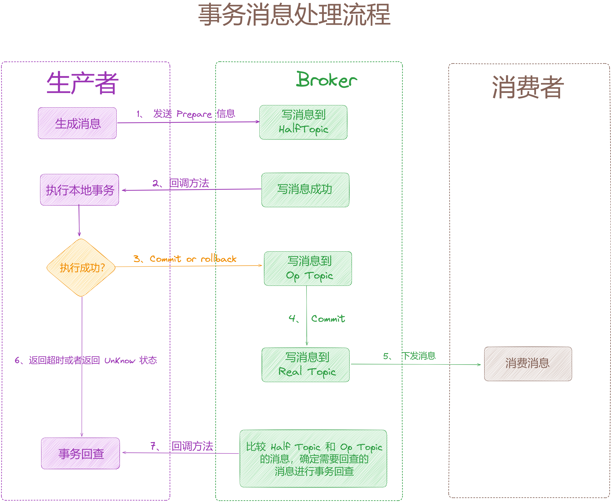