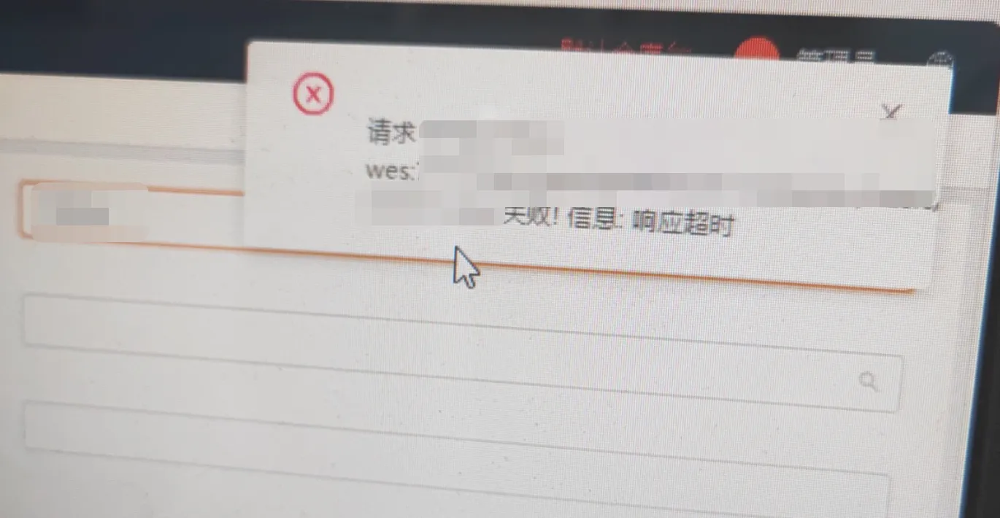

## 一、问题分析过程

深圳某智能仓现场反馈报错：



接着全场工作站页面无法点击。


立即连接该仓库的服务器，查看 WES 服务 Docker 容器的状态，是 unhealthy 状态。考虑恢复优先，立即重启容器。现场恢复，但过一会儿，现场又反馈很卡顿。重新连线，发现容器状态又变成 unhealthy 了。


执行 `jstat -gc pid 1000`：

- 最近有 Full GC 过。
- GC 很频繁。

而且慢 SQL 很多，一次三十秒以上的有很多。从慢 SQL 语句内容上分析：

- 查询的表内容主要集中在出库单明细、出库单实操明细、反馈明细上。
- 查询条件都是 `in (id1, id2……)`,并且都是大列表查询。
- 状态都与待反馈或者反馈中有关。


**从业务关联上猜测是发货相关逻辑出现了问题。**


查看出库单状态：

```json
select count(*) from 出库单表 where state = 待发货状态
```

- 好家伙，两百多万条全是待发货。
- 再看反馈明细，未反馈的实操明细更多，600 多万……


**已经有了初步怀疑，反馈逻辑出问题了。**


**扒代码，流程大概如下:**

- WES 发送 MQ 消息，告知单据已拣选完成，需要反馈上游告知单据的拣选信息。
- 反馈服务收到消息后，请求上游告知出库单拣选信息。
- 收到上游接口成功的 response 后，调用接口，处理一些逻辑，最后更新单据反馈明细为反馈完成。
- WES 定时器逻辑：

- WES 定时器查询订单状态为待发货并且反馈状态为反馈中的订单。
- 根据订单查询反馈明细。
- 如果反馈明细都反馈完成了，则更新订单反馈状态为反馈完成。


了解上述简要逻辑之后，我们再来分析现场问题。


查看反馈日志，捞了一些待发货的单子，发现所有的单子都反馈了。理论上对于上游来说，所有的流程已经走完了。


**那只能是最后一步更新单据反馈明细状态出了问题**：更新单据反馈明细为反馈完成。


**看 log**，很多 `response error`， 但是实际的 http status code 是 200。感觉不太对劲，应该是最关键的信息了。


细看日志上下文，发现上游返回的 response 格式不对，理论上按约定是：

```json
{
  "一些额外信息": "",
  "body": {
    "code": "200",
    "data": "……",
    "message": "success",
    "success": false
  }
}
```

但上游实际返回的是：

```json
{
  "success": true,
  "code": 0,
  "message": "success",
  "data": "……",
}
```

导致反馈服务根据约定格式解析的时候发现获取不到 body 信息，以为出错了。


**收到上游接口成功的 response 后，调用接口，处理一些逻辑，最后更新单据反馈明细为反馈完成。**
所以单据反馈明细一直是反馈中的状态，导致后续的逻辑一直无法正常执行。

## 二、故障原因总结

上游在升级的时候，误改了接口格式，导致 WES 按照约定的格式处理接口返回数据时，拿不到指定格式的数据，导致单据无法正常完结。

## 三、如何快速恢复

- **写 SQL 批量更新单据状态为完成，并打上特殊标记：** 先避免重启一直扫表查大量数据问题，让现场恢复。
- **重启线上服务。**

**代码层面：**

- **增量数据：**

  - 兼容上游数据格式。

  - 与上游再次沟通，约定不要随意更改接口格式。

- **存量数据**更改定时器逻辑： 

  - 记录最大 ID。

  - 每次根据状态加特殊标记捞取 1000 条数据。

  - 批量执行：收到上游接口成功的 response 后，调用接口，处理一些逻辑，最后更新单据反馈明细为反馈完成。