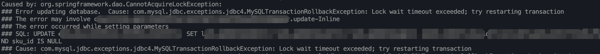
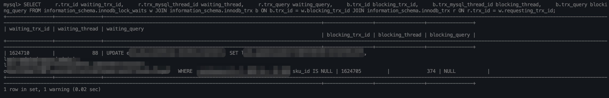
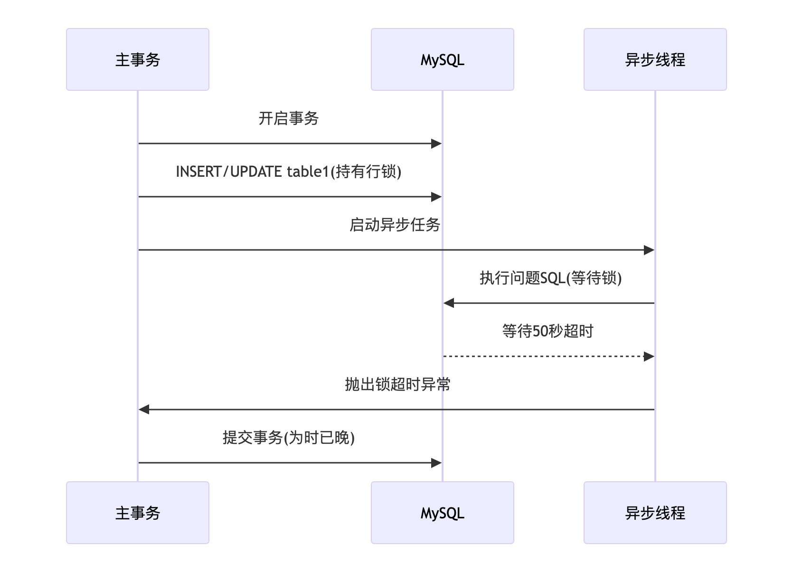
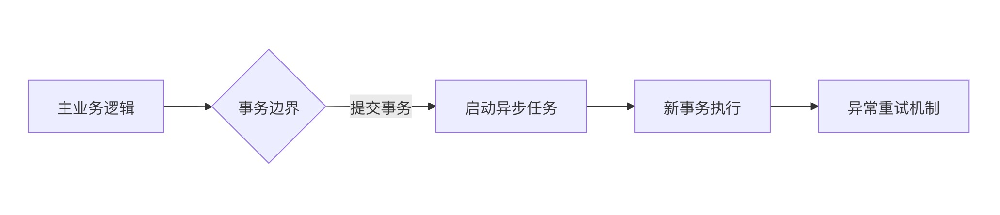

### 一、故障现象

海外仓项目入库流程出现异常，线上日志报错：



```plain
org.springframework.dao.CannotAcquireLockException: 
Lock wait timeout exceeded; try restarting transaction
```

从日志上看，很明显，MySQL 锁超时了。

### 二、故障定位与分析

#### 1. 问题SQL锁定（已脱敏）

```plain
UPDATE table1 
SET column1 = value1, column2 = value2 
WHERE a_id_1 = 666 AND id = 888 
AND sku_id IS NULL  -- 问题关键点
```

#### 2. 锁等待分析

有监控系统的话，可以直接看监控系统。

我在本地复现了该问题，学习一下相关命令：

```sql
-- 查看当前锁等待
SELECT * FROM information_schema.innodb_lock_waits;

-- 查看持锁和等待锁的事务
SELECT * FROM information_schema.innodb_trx;

-- 查看被锁的行
SELECT * FROM information_schema.innodb_locks;
/* 锁等待分析语句 */
SELECT
    r.trx_id waiting_trx_id,
    r.trx_mysql_thread_id waiting_thread,
    r.trx_query waiting_query,
    b.trx_id blocking_trx_id,
    b.trx_mysql_thread_id blocking_thread,
    b.trx_query blocking_query
FROM information_schema.innodb_lock_waits w
JOIN information_schema.innodb_trx b ON b.trx_id = w.blocking_trx_id
JOIN information_schema.innodb_trx r ON r.trx_id = w.requesting_trx_id;
```


SQL 执行结果如下图：



可以看出具体的 SQL 语句。


看代码，简化后的逻辑：

```java
事务开启：

……省略前置逻辑……
保存新行到 table1 
…… 省略中间逻辑……
if 满足条件 {
    开启异步线程池，异步更新新行
}
…… 省略后续逻辑……

提交事务
```




#### 3. 根本原因分析

| 问题维度 | 具体原因                         | 影响程度 |
| -------- | -------------------------------- | -------- |
| 事务边界 | 在未提交的事务内启动异步更新     | ⭐⭐⭐⭐     |
| SQL设计  | `sku_id IS NULL`导致额外锁定检查 | ⭐⭐⭐      |
| 架构设计 | 主事务与异步操作竞争同一资源     | ⭐⭐       |
| 超时配置 | 默认50秒等待时间未优化           | ⭐        |

### 三、故障恢复

#### 1. SQL优化

```plain
UPDATE table1 
SET column1 = value1, column2 = value2 
WHERE a_id_1 = 666 AND id = 888 
- AND sku_id IS NULL
```

**优化依据**：
业务验证确认`sku_id IS NULL`条件冗余（当a_id_1和id确定时记录唯一）

#### 2. 事务架构重构

```plain
// 改造前（问题版本）
@Transactional
void process() {
    save(table1); // 锁定行
    // 在事务内启动异步
    executor.execute(() -> updateTable()); 
    // ...其他业务逻辑
} // 事务提交

// 改造后（修复版本）
void process() {
    // 1. 在主事务中完成核心操作
    transactionTemplate.execute(status -> {
        save(table1);
        return null;
    });
    
    // 2. 事务提交后启动异步
    executor.execute(() -> {
        // 3. 异步操作使用独立事务
        transactionTemplate.execute(status -> {
            updateTable();
            return null;
        });
    });
}
```

#### 3. 异步处理规范



**关键原则**：

1. **事务分离**：主事务与异步任务完全解耦
2. **后置启动**：确保在事务提交后才触发异步
3. **独立事务**：异步任务使用全新事务上下文