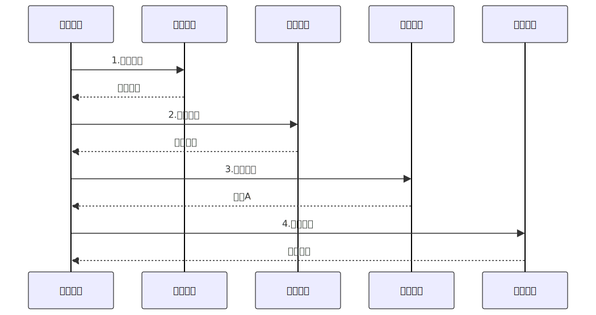

Saga是针对分布式长活事务的解决方案，针对事务长、多、复杂的情况，特别是服务由多个公司开发具有不可控性，可以使用Saga模式进行分布式事务的处理。

Saga在处理事务一致性方面采取了**向前恢复**和**向后恢复**策略，前者通过不断重试的方式保证事务完成，而后者通过子事务的补偿事务，逐一回滚的方式让事务标记失败。

在分布式协调方面，Saga采用了两种模式：编排和控制。前者让参与者（服务）之间通过消息进行沟通，根据事件出发事务的执行流程，是一种去中心化的模式。后者通过中心控制类，处理事务的执行和回滚步骤，统一调用服务和接受服务的反馈。

------

### 一、核心场景：电商订单全流程拆解

想象一个国际电商订单流程：

1. **订单服务** → 创建订单
2. **支付服务** → 扣款
3. **风控服务** → 反欺诈检查（耗时1-5秒）
4. **物流服务** → 分配仓库
5. **库存服务** → 扣减库存

**若风控审核失败，系统需按倒序回滚**：

1. 撤销仓库分配（物流服务）
2. 退款（支付服务）
3. 取消订单（订单服务）

------

### 二、Saga实现机制：两种核心模式对比

#### 1. 协同式 (Choreography)

**无中心协调器，服务间通过事件触发**

**特征**：

- 服务直接发布/订阅事件
- 无单点故障风险
- 调试复杂度较高（需跟踪事件流）

#### 2. 编排式 (Orchestration)

**由协调器统一控制流程**

**特征**：

- 集中管理状态流转
- 易监控和调试
- 协调器成为性能瓶颈风险

💡 技术选型建议：
流程节点 ≤ 5 → **协同式**（轻量敏捷）
流程节点 > 5 → **编排式**（可控性强）

------

