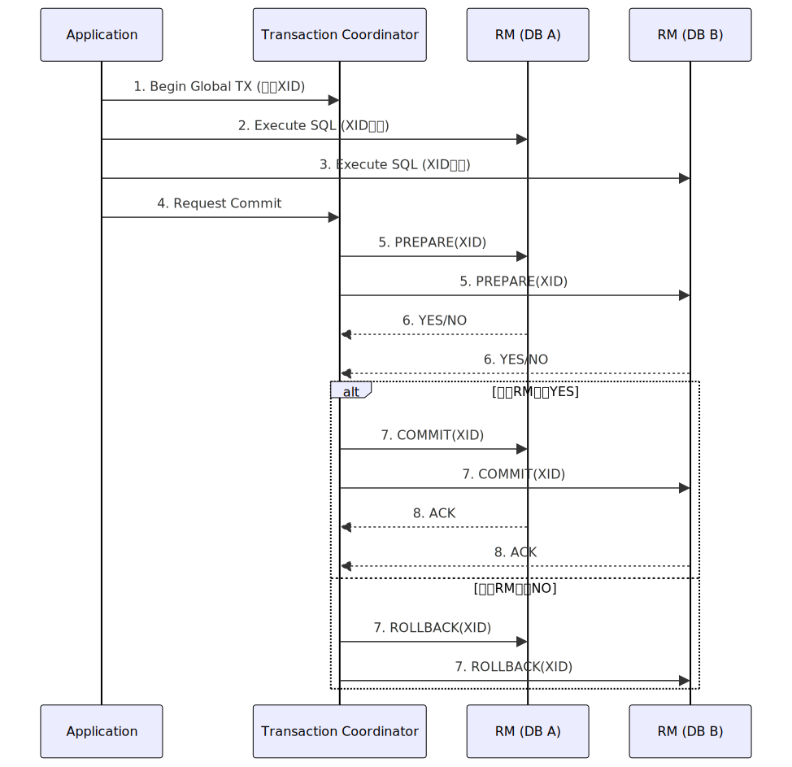

## 一、XA协议核心概念

#### 1. **定义**

- **XA**（Extended Architecture）：由X/Open组织（现为Open Group）提出的**分布式事务处理规范**。
- 核心目标：确保跨多个独立资源（如数据库、消息队列）的事务操作满足**ACID**中的原子性（Atomicity）。

#### 2. 关键角色

| 角色   | 英文全称                | 职责                                  |
| ------ | ----------------------- | ------------------------------------- |
| **AP** | Application Program     | 发起全局事务的应用程序                |
| **TC** | Transaction Coordinator | 事务协调器，管理全局事务生命周期      |
| **RM** | Resource Manager        | 资源管理器（如MySQL、Oracle等数据库） |

#### 3. 核心协议：**2PC**（Two-Phase Commit，两阶段提交）



------

### 二、两阶段提交详解

#### 阶段1：**Prepare Phase（准备阶段）**

1. TC向所有RM发送 `XA PREPARE` 指令。  
2. 各RM执行本地事务（**不提交**），锁定资源并写入Undo/Redo日志。  
3. RM返回投票结果：  

- **YES**：确保本地事务可提交。  
- **NO**：本地事务失败（如违反约束）。

#### 阶段2：**Commit Phase（提交阶段）**

- **Case 1: 全部YES → 提交**
  TC发送 `XA COMMIT`，RM提交事务并释放锁。
- **Case 2: 任一NO → 回滚**
  TC发送 `XA ROLLBACK`，RM撤销操作并释放锁。

```plain
          +-----------------+      Phase 1      +-----------------+
          | Transaction     | ----------------> | Resource        |
          | Coordinator (TC)| <---------------- | Manager (RM)    |
          +-----------------+    Vote (YES/NO)  +-----------------+
                      |
                      | Phase 2 (根据投票结果)
                      v
           +-----------+-----------+  
           |                       |
      +----+-----+           +-----+----+
      | COMMIT   |           | ROLLBACK |
      +----+-----+           +-----+----+
           |                       |
           v                       v
    资源持久化               撤销本地操作
```

------

### 三、XA关键接口（API）

| 接口            | 英文全称    | 功能         |
| --------------- | ----------- | ------------ |
| `xa_open()`     | XA Open     | 连接RM       |
| `xa_close()`    | XA Close    | 断开RM连接   |
| `xa_start()`    | XA Start    | 启动事务分支 |
| `xa_end()`      | XA End      | 结束事务分支 |
| `xa_prepare()`  | XA Prepare  | 进入准备阶段 |
| `xa_commit()`   | XA Commit   | 提交事务     |
| `xa_rollback()` | XA Rollback | 回滚事务     |
| `xa_recover()`  | XA Recover  | 恢复悬挂事务 |

------

### 四、XA的挑战与缺陷

#### 1. **性能瓶颈**



#### 2. **故障风险**

- **单点故障（SPOF）**：TC宕机导致所有RM阻塞。  
- **悬挂事务（In-doubt Transaction）**：
  RM在Prepare后未收到TC指令时，事务状态不确定。
- **网络分区**：可能导致部分提交、部分回滚。

#### 3. **恢复机制**

- TC崩溃后：新TC通过 `xa_recover()` 扫描所有RM的**Prepared状态事务**，重做决策。
- RM崩溃后：根据日志重放事务（提交/回滚）。

------

### 五、XA vs. CAP定理

```plain
    Consistency
       ↑
XA强一致 → 牺牲Availability
       ↓
    Partition Tolerance (必须保障)
```

**结论**：XA在分区（Partition）发生时，会阻塞系统（CP模型），无法满足高可用。

------

### 六、适用场景

- ✅ 传统金融系统（强一致性优先）  
- ✅ 单应用整合多个关系型数据库（如MySQL+Oracle）  
- ❌ 微服务架构（服务自治要求高）  
- ❌ 高并发低延迟场景（如电商秒杀）

------

### 附录：XA事务状态机

```plain
          +---------+       +----------+       +-----------+
          | BEGIN   | ----> | ACTIVE   | ----> | PREPARED  |
          +---------+       +----------+       +-----------+
                                |                   |
                                | (失败/超时)       | (TC决策)
                                v                   v
                          +-----------+       +-----------+
                          | ROLLBACK  | <-----| COMMITTED |
                          +-----------+       +-----------+
```

通过以上分析，XA协议通过标准化接口和2PC机制解决了分布式原子性问题，但其性能与可用性限制使其在云原生时代逐渐被TCC、Saga等柔性事务替代。