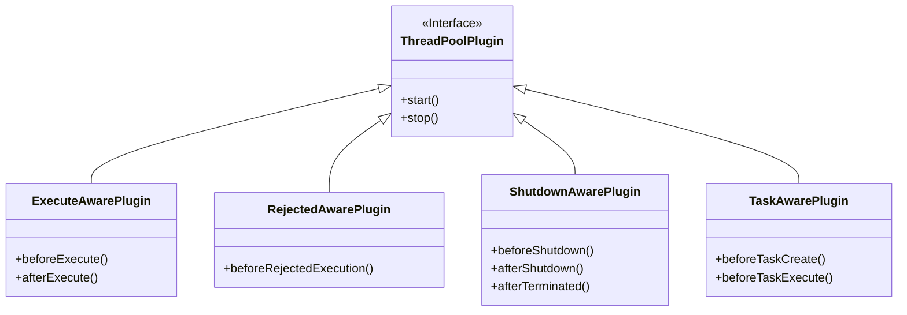

JDK 线程池的生命周期中包含多个关键扩展点，通过这些扩展点我们可以实现监控、调优、报警等高级功能：

### 一、核心扩展点

1. **任务执行监听点**
   - `beforeExecute()`：任务执行前触发
   - `afterExecute()`：任务完成后触发（含异常情况）
   - 应用场景：耗时统计、超时检测、任务埋点
2. **线程池关闭监听点**
   - `beforeShutdown()`：关闭线程池前触发
   - `afterShutdown()`：关闭线程池后触发（带未完成任务）
   - `afterTerminated()`：线程池完全终止后触发
   - 应用场景：资源释放、优雅关机
3. **任务拒绝拦截点**
   - `beforeRejectedExecution()`：触发拒绝策略前执行
   - 应用场景：拒绝计数、预警通知
4. **任务创建/执行拦截点**
   - `beforeTaskCreate()`：创建任务对象前（支持Runnable/Callable）
   - `beforeTaskExecute()`：任务执行前最后处理点
   - 应用场景：任务装饰、上下文传递

### 二、插件体系设计

```mermaid
classDiagram
direction BT
class AbstractTaskTimerPlugin {
  + AbstractTaskTimerPlugin() 
  + beforeExecute(Thread, Runnable) void
  # currentTime() long
  # processTaskTime(long) void
  + afterExecute(Runnable, Throwable) void
}
class ExecuteAwarePlugin {
<<Interface>>
  + beforeExecute(Thread, Runnable) void
  + afterExecute(Runnable, Throwable) void
}
class RejectedAwarePlugin {
<<Interface>>
  + beforeRejectedExecution(Runnable, ThreadPoolExecutor) void
}
class ShutdownAwarePlugin {
<<Interface>>
  + afterShutdown(ThreadPoolExecutor, List~Runnable~) void
  + afterTerminated(ExtensibleThreadPoolExecutor) void
  + beforeShutdown(ThreadPoolExecutor) void
}
class Summary {
  + Summary(long, long, long, long) 
  - long taskCount
  - long minTaskTimeMillis
  - long totalTaskTimeMillis
  - long maxTaskTimeMillis
   long maxTaskTimeMillis
   long taskCount
   long minTaskTimeMillis
   long totalTaskTimeMillis
   long avgTaskTimeMillis
}
class TaskAwarePlugin {
<<Interface>>
  + beforeTaskCreate(ThreadPoolExecutor, Runnable, V) Runnable
  + beforeTaskCreate(ThreadPoolExecutor, Callable~V~) Callable~V~
  + beforeTaskExecute(Runnable) Runnable
}
class TaskDecoratorPlugin {
  + TaskDecoratorPlugin() 
  - List~TaskDecorator~ decorators
  + removeDecorator(TaskDecorator) void
  + clearDecorators() void
  + beforeTaskExecute(Runnable) Runnable
  + addDecorator(TaskDecorator) void
   PluginRuntime pluginRuntime
   String id
   List~TaskDecorator~ decorators
}
class TaskRejectCountRecordPlugin {
  + TaskRejectCountRecordPlugin() 
  - AtomicLong rejectCount
  + beforeRejectedExecution(Runnable, ThreadPoolExecutor) void
   PluginRuntime pluginRuntime
   Long rejectCountNum
   AtomicLong rejectCount
   String id
}
class TaskRejectNotifyAlarmPlugin {
  + TaskRejectNotifyAlarmPlugin() 
  + beforeRejectedExecution(Runnable, ThreadPoolExecutor) void
   String id
}
class TaskTimeRecordPlugin {
  + TaskTimeRecordPlugin() 
  + summarize() Summary
  # processTaskTime(long) void
   PluginRuntime pluginRuntime
   String id
}
class TaskTimeoutNotifyAlarmPlugin {
  + TaskTimeoutNotifyAlarmPlugin(String, Long, ThreadPoolExecutor) 
  - Long executeTimeOut
  # processTaskTime(long) void
   String id
   Long executeTimeOut
}
class ThreadPoolExecutorShutdownPlugin {
  + ThreadPoolExecutorShutdownPlugin(long) 
  + long awaitTerminationMillis
  - awaitTerminationIfNecessary(ExtensibleThreadPoolExecutor) void
  + beforeShutdown(ThreadPoolExecutor) void
  # cancelRemainingTask(Runnable) void
  + afterShutdown(ThreadPoolExecutor, List~Runnable~) void
   PluginRuntime pluginRuntime
   String id
   long awaitTerminationMillis
}
class ThreadPoolPlugin {
<<Interface>>
  + start() void
  + stop() void
   PluginRuntime pluginRuntime
   String id
}

AbstractTaskTimerPlugin  ..>  ExecuteAwarePlugin 
ExecuteAwarePlugin  -->  ThreadPoolPlugin 
RejectedAwarePlugin  -->  ThreadPoolPlugin 
ShutdownAwarePlugin  -->  ThreadPoolPlugin 
TaskTimeRecordPlugin  -->  Summary 
TaskAwarePlugin  -->  ThreadPoolPlugin 
TaskDecoratorPlugin  ..>  TaskAwarePlugin 
TaskRejectCountRecordPlugin  ..>  RejectedAwarePlugin 
TaskRejectNotifyAlarmPlugin  ..>  RejectedAwarePlugin 
TaskTimeRecordPlugin  -->  AbstractTaskTimerPlugin 
TaskTimeoutNotifyAlarmPlugin  -->  AbstractTaskTimerPlugin 
ThreadPoolExecutorShutdownPlugin  ..>  ShutdownAwarePlugin 

```






### 三、实用插件实现

#### 1. 监控类插件

- **任务耗时统计插件** (TaskTimeRecordPlugin)

  ```
  public class TaskTimeRecordPlugin extends AbstractTaskTimerPlugin {
      // 记录最小、最大、平均耗时
      public Summary summarize() {
          return new Summary(taskCount, minTaskTime, totalTaskTime, maxTaskTime);
      }
  }
  ```

- **拒绝任务计数器** (TaskRejectCountRecordPlugin)

  ```
  public class TaskRejectCountRecordPlugin implements RejectedAwarePlugin {
      private final AtomicLong rejectCount = new AtomicLong();
      
      public void beforeRejectedExecution(Runnable task, ThreadPoolExecutor executor) {
          rejectCount.incrementAndGet();
      }
  }
  ```

#### 2. 告警类插件

- **任务超时报警** (TaskTimeoutNotifyAlarmPlugin)

  ```
  public class TaskTimeoutNotifyAlarmPlugin extends AbstractTaskTimerPlugin {
      private final Long executeTimeOut; // 超时阈值
      
      protected void processTaskTime(long taskTime) {
          if(taskTime > executeTimeOut) {
              // 触发告警逻辑
          }
      }
  }
  ```

- **拒绝任务告警** (TaskRejectNotifyAlarmPlugin)

  ```
  public class TaskRejectNotifyAlarmPlugin implements RejectedAwarePlugin {
      public void beforeRejectedExecution(Runnable task, ThreadPoolExecutor executor) {
          // 发送实时告警通知
      }
  }
  ```

#### 3. 增强类插件

- **任务装饰器** (TaskDecoratorPlugin)

  ```
  public class TaskDecoratorPlugin implements TaskAwarePlugin {
      private final List<TaskDecorator> decorators = new ArrayList<>();
      
      public Runnable beforeTaskExecute(Runnable task) {
          Runnable wrapped = task;
          for(TaskDecorator decorator : decorators) {
              wrapped = decorator.decorate(wrapped);
          }
          return wrapped;
      }
  }
  ```

- **优雅停机插件** (ThreadPoolExecutorShutdownPlugin)

  ```
  public class ThreadPoolExecutorShutdownPlugin implements ShutdownAwarePlugin {
      private final long awaitTerminationMillis;
      
      public void afterShutdown(ThreadPoolExecutor executor, List<Runnable> remainingTasks) {
          // 等待配置时间让任务完成
          executor.awaitTermination(awaitTerminationMillis, TimeUnit.MILLISECONDS);
      }
  }
  ```

